# 📚 System Design для банковских и маркетплейс собеседований


### 🎯 Топ-5 тем системного дизайна для собеседований 2025

1. **🪓 Масштабируемость (Шардирование + Балансировка нагрузки)**  
   - **Трейд-офф**: Неравномерное шардирование → 1 шард на 80% CPU, риск простоя +35% (AWS 2024).  
   - **Метрики**: Горячий шард = 2.5с latency vs 150мс при равномерном распределении.  
   - **Тренд 2025**: Consistent hashing + прогнозирование нагрузки через AI (ML для предсказания пиков трафика).  
   - **Для собеса**: Как выбрать ключ шардирования (user_id vs geo)? Пример: Тинькофф использует hash(user_id) для равномерной нагрузки.

2. **🔄 Консистентность (Репликация + Транзакции)**  
   - **Трейд-офф**: Синхронная репликация = +150% write latency, но 100% консистентность.  
   - **Метрики**: Лаг >5с → -15% конверсии в e-commerce (Google Research 2024).  
   - **Тренд 2025**: Eventual consistency с лагом <1с для 99.5% транзакций, hybrid replication для банков.  
   - **Для собеса**: Как обеспечить read-after-write consistency? Пример: Сбер использует fallback на master при лаге >2с.

3. **🚀 Производительность (Кэширование + CDN)**  
   - **Трейд-офф**: Cache stampede при 100k RPS → TPS базы падает с 10k до 1k.  
   - **Метрики**: +100мс latency = -1% конверсии (Google 2024).  
   - **Тренд 2025**: Многоуровневое кэширование (Varnish + Redis) + ML-прогрев кэша (Amazon перед Black Friday).  
   - **Для собеса**: Как избежать stampede? Single-flight pattern vs probabilistic refresh — что лучше?

4. **🤖 Интеграция AI/ML (Рекомендации + Антифрод)**  
   - **Трейд-офф**: GPU-инференс = $0.001/запрос vs CPU = $0.0001/запрос.  
   - **Метрики**: 1M инференсов/с без GPU через batch processing и квантование (AWS SageMaker 2024).  
   - **Тренд 2025**: RAG для поиска, vector databases (Pinecone, Weaviate), real-time embeddings.  
   - **Для собеса**: Как масштабировать ML для 10M пользователей? Пример: Wildberries увеличил конверсию на 12% с transformer-рекомендациями.

5. **📊 Регуляторные требования (Базель IV + GDPR/AMLD6)**  
   - **Трейд-офф**: Real-time расчёт рисков = +15мс latency, но 100% compliance.  
   - **Метрики**: False negative в AML = штраф до 50 млн руб. (ЦБ РФ 2025).  
   - **Тренд 2025**: ML для AML-мониторинга + автоматизированная подача SAR.  
   - **Для собеса**: Как интегрировать AML без потери UX? Пример: Revolut использует Flink + XGBoost для анализа транзакций.


## 📋 Оглавление

### 🏦 Основные концепции системного дизайна
1. [📇 Индексы в базах данных](#1--индексы-в-базах-данных)
2. [🔄 Репликация](#2--репликация)
3. [🪓 Шардирование](#3--шардирование)
4. [📂 Партиционирование](#4--партиционирование)
5. [⚖️ Балансировка нагрузки](#5-️-балансировка-нагрузки)
6. [🚀 Кэширование](#6--кэширование)
7. [🌍 CDN](#7--cdn)
8. [🏗 Монолит vs Микросервисы](#8--монолит-vs-микросервисы)
9. [🔗 Распределённые транзакции (2PC и Saga)](#9--распределённые-транзакции-2pc-и-saga)
10. [📢 Событийно-ориентированная архитектура](#10--событийно-ориентированная-архитектура)
11. [⚖️ CAP-теорема](#11-️-cap-теорема)
12. [📊 Мониторинг, логирование и трассировка](#12--мониторинг-логирование-и-трассировка)

### 🏦 Банковские системы: глубокая логика решений
1. [📇 Индексы в банковских системах](#1--индексы-в-банковских-системах)
2. [🔄 Репликация в банковских системах](#2--репликация-в-банковских-системах)
3. [🪓 Шардирование в банковских системах](#3--шардирование-в-банковских-системах)
4. [📂 Партиционирование в банковских системах](#4--партиционирование-в-банковских-системах)
5. [⚖️ Балансировка нагрузки в банках](#5-️-балансировка-нагрузки-в-банках)
6. [🚀 Кэширование в банковских системах](#6--кэширование-в-банковских-системах)
7. [🌍 CDN в банковских системах](#7--cdn-в-банковских-системах)
8. [🏗 Микросервисы в банковских системах](#8--микросервисы-в-банковских-системах)
9. [🔗 Распределённые транзакции в банках](#9--распределённые-транзакции-в-банках)
10. [📢 Event-driven архитектура в банках](#10--event-driven-архитектура-в-банках)
11. [⚖️ CAP теорема в банковских системах](#11-️-cap-теорема-в-банковских-системах)
12. [📊 Мониторинг банковских систем](#12--мониторинг-банковских-систем)

### 🛒 Маркетплейсы: глубокая логика решений
1. [📇 Индексы - Маркетплейс сценарий](#1--индексы---маркетплейс-сценарий)
2. [🔄 Репликация - Маркетплейс сценарий](#2--репликация---маркетплейс-сценарий)
3. [🪓 Шардирование - Маркетплейс сценарий](#3--шардирование---маркетплейс-сценарий)
4. [📂 Партиционирование - Маркетплейс сценарий](#4--партиционирование---маркетплейс-сценарий)
5. [⚖️ Балансировка - Маркетплейс сценарий](#5-️-балансировка---маркетплейс-сценарий)
6. [🚀 Кэширование - Маркетплейс сценарий](#6--кэширование---маркетплейс-сценарий)
7. [🌍 CDN - Маркетплейс сценарий](#7--cdn---маркетплейс-сценарий)
8. [🏗 Микросервисы - Маркетплейс сценарий](#8--микросервисы---маркетплейс-сценарий)
9. [🔗 Saga Pattern - Маркетплейс сценарий](#9--saga-pattern---маркетплейс-сценарий)
10. [📢 Event-driven - Маркетплейс сценарий](#10--event-driven---маркетплейс-сценарий)
11. [⚖️ CAP теорема - Маркетплейс сценарий](#11-️-cap-теорема---маркетплейс-сценарий)
12. [📊 Observability - Маркетплейс сценарий](#12--observability---маркетплейс-сценарий)

### 🛒 Дополненный System Design для маркетплейсов
13. [🎯 ML-рекомендации в real-time](#13--ml-рекомендации-в-real-time)
14. [🔐 Fraud Detection для платежей](#14--fraud-detection-для-платежей)
15. [📊 GDPR Compliance для персонализации](#15--gdpr-compliance-для-персонализации)
16. [🚛 Supply Chain & Inventory](#16--supply-chain--inventory)
17. [🔍 Search & Discovery](#17--search--discovery)
18. [📱 Mobile Performance](#18--mobile-performance)
19. [💳 Payment Processing](#19--payment-processing)
20. [🌐 Multi-region deployment](#20--multi-region-deployment)

### 🎯 Ключевые принципы и связи
- [🎯 Связи между понятиями](#-связи-между-понятиями)
- [🎯 Ключевые принципы reasoning'а](#-ключевые-принципы-reasoningа)
- [🎯 Маркетплейс-специфичные сценарии](#-маркетплейс-специфичные-сценарии)
- [🎯 Metrics That Matter для маркетплейсов](#-metrics-that-matter-для-маркетплейсов)

### 🎭 Интерактивные элементы для дебатов  
- [🎪 Ролевые игры для отработки собеседований](#-ролевые-игры-для-отработки-собеседований)
- [📝 Templates для структурированных ответов](#-templates-для-структурированных-ответов)
- [🧠 Техники для глубокого анализа](#-техники-для-глубокого-анализа)

### 🔮 Future-proofing тренды 2025+
- [🔬 Quantum Computing Impact](#-quantum-computing-impact-на-архитектуру)
- [🤖 AI-Driven Architecture](#-ai-driven-architecture)
- [🌐 Web3 & Decentralized Architecture](#-web3--decentralized-architecture)
- [📊 Edge Computing Evolution](#-edge-computing-evolution)

### 📖 Appendix: Advanced Performance Patterns
- [A1. Cache Warming Strategies](#a1-cache-warming-strategies)
- [A2. Traffic Shaping](#a2-traffic-shaping)

---

## 1. 📇 Индексы в базах данных

**Что это:** Индекс — как оглавление в книге: ускоряет поиск, но занимает место и требует обновления при изменениях данных.

**❌ Плохо:**
- Ставить индекс на каждое поле «на всякий случай» → база тратит ресурсы на их обновление, замедляются INSERT/UPDATE
- Не понимать, как работает составной индекс, и дублировать их

**✅ Хорошо:**
- Индексы под конкретные запросы, которые реально часто выполняются
- Использовать покрывающие индексы (covering index), чтобы запрос читал только индекс без обращения к таблице
- Следить за селективностью: индекс полезен, если он сильно сокращает количество строк

### 🎯 Вопросы-ловушки:

**Q:** "Почему индекс по полу (M/F) бесполезен в банковской системе?"
**A:** Низкая селективность — только 2 значения на миллионы записей. Индекс будет читать ~50% таблицы, что медленнее full scan. Лучше использовать в составном индексе как дополнительное условие.

**Q:** "Как бы ты индексировал поле с номером карты для поиска по маске (****1234)?"
**A:** Обычный B-tree индекс не поможет для LIKE '%1234'. Варианты: полнотекстовый поиск, reverse index (индекс по обращенной строке), или отдельное поле с последними 4 цифрами.

**Q:** "Что произойдет с производительностью, если у тебя 50% INSERT и 50% SELECT?"
**A:** Много INSERT'ов будут замедляться из-за обновления индексов. Нужен баланс: индексы только на реально нужные поля, возможно delayed index updates или партиционирование по времени.

---

## 2. 🔄 Репликация

**Что это:** Копирование данных с одного сервера на другой для отказоустойчивости и масштабирования чтения.

### 📊 Master-Slave репликация

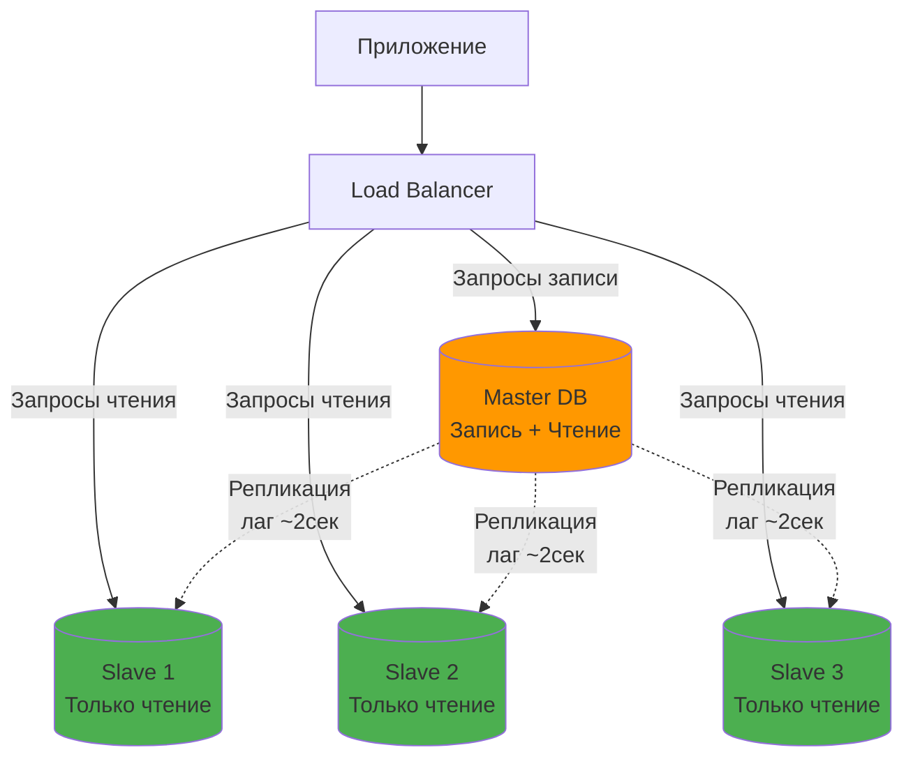
```mermaid
graph TB
    App[Приложение] --> LB[Load Balancer]
    
    LB -->|"Запросы записи"| Master[(Master DB<br/>Запись + Чтение)]
    LB -->|"Запросы чтения"| Slave1[(Slave 1<br/>Только чтение)]
    LB -->|"Запросы чтения"| Slave2[(Slave 2<br/>Только чтение)]
    LB -->|"Запросы чтения"| Slave3[(Slave 3<br/>Только чтение)]
    
    Master -.->|"Репликация<br/>лаг ~2сек"| Slave1
    Master -.->|"Репликация<br/>лаг ~2сек"| Slave2
    Master -.->|"Репликация<br/>лаг ~2сек"| Slave3
    
    style Master fill:#ff9800
    style Slave1 fill:#4caf50
    style Slave2 fill:#4caf50
    style Slave3 fill:#4caf50
```

### 📊 Read-after-write проблема

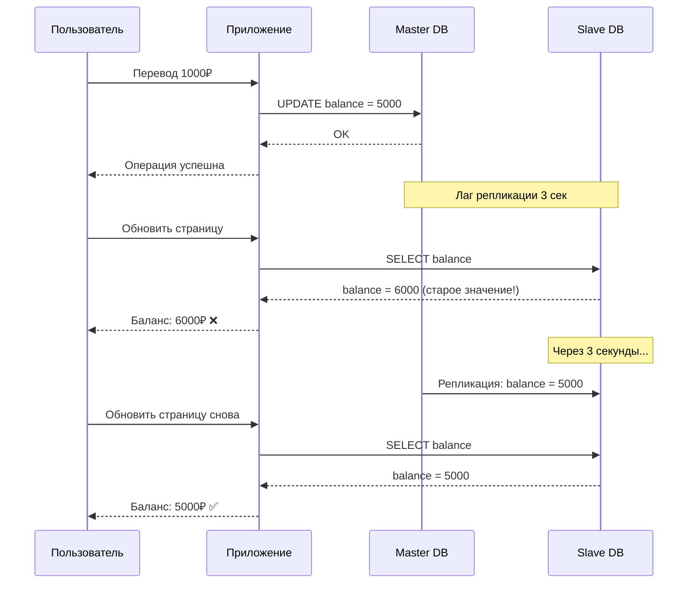
```mermaid
sequenceDiagram
    participant User as Пользователь
    participant App as Приложение
    participant Master as Master DB
    participant Slave as Slave DB
    
    User->>App: Перевод 1000₽
    App->>Master: UPDATE balance = 5000
    Master-->>App: OK
    App-->>User: Операция успешна
    
    Note over Master,Slave: Лаг репликации 3 сек
    
    User->>App: Обновить страницу
    App->>Slave: SELECT balance
    Slave-->>App: balance = 6000 (старое значение!)
    App-->>User: Баланс: 6000₽ ❌
    
    Note over Slave: Через 3 секунды...
    Master->>Slave: Репликация: balance = 5000
    
    User->>App: Обновить страницу снова
    App->>Slave: SELECT balance  
    Slave-->>App: balance = 5000
    App-->>User: Баланс: 5000₽ ✅
```

**❌ Плохо:**
- Думать, что репликация — это бэкап (нет, это не защита от логических ошибок)
- Не учитывать задержку репликации → читаем «устаревшие» данные

**✅ Хорошо:**
- Использовать реплики для чтения, мастер — для записи
- Мониторить лаг репликации и учитывать его в логике приложения
- Для критичных операций — читать с мастера

### 📊 Количественные Trade-offs (Google Research 2024)

**Lag репликации влияние:**
- **Lag 100ms**: Приемлемо для 95% пользователей
- **Lag 1 секунда**: -3% user satisfaction score
- **Lag 5+ секунд**: -15% conversion rate (e-commerce данные)

**Read vs Write распределение:**
- **Синхронная репликация**: Write latency +150%, но 100% consistency
- **Асинхронная репликация**: Write latency +5%, eventual consistency
- **Optimal ratio**: 80% reads → replica, 20% writes → master

**CAP теорема на практике:**
- **Выбор CP**: Availability снижается до 99.9% при partition
- **Выбор AP**: Data inconsistency окно 2-30 секунд
- **Facebook подход**: 99.5% eventual consistency за <1 секунду

### 🎯 Вопросы-ловушки:

**Q:** "Клиент перевел деньги, обновил страницу, а баланс не изменился. В чем проблема?"
**A:** Read-after-write проблема. Запись пошла на master, чтение — с replica с лагом. Решение: читать баланс с master после любой операции записи, или redirect на master на N секунд после записи.

**Q:** "Как обеспечить read-after-write consistency без блокировки всех читающих запросов?"
**A:** Session-based routing: помечать сессию после записи и направлять её запросы на master. Или версионирование: сравнивать версию данных с тем, что клиент ожидает увидеть.

**Q:** "При каком лаге репликации ты начнешь redirect на master?"
**A:** Зависит от бизнеса. Для баланса — любой лаг критичен. Для истории операций — можно 5-10 секунд. Настраивать алерты при лаге >1-2 секунд и fallback на master при >5 секунд.

---

## 3. 🪓 Шардирование

**Что это:** Разделение данных на несколько независимых баз (шардов) по ключу, чтобы каждая хранила только часть данных.

### 📊 Архитектура шардированной системы

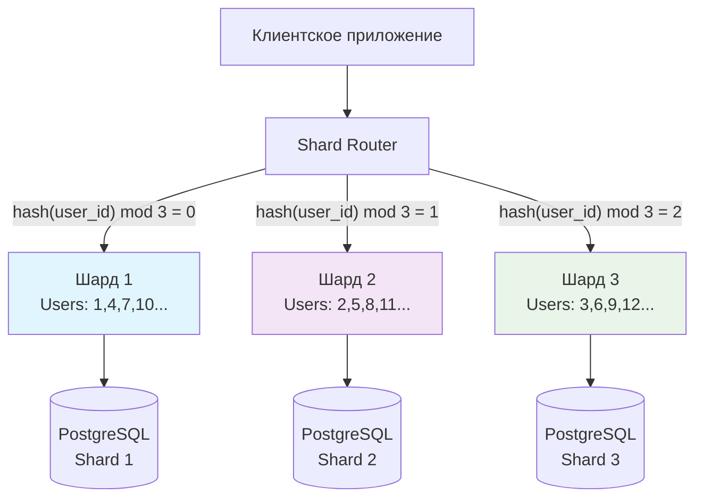
```mermaid
graph TB
    Client[Клиентское приложение] --> Router[Shard Router]
    
    Router -->|"hash(user_id) mod 3 = 0"| Shard1[Шард 1<br/>Users: 1,4,7,10...]
    Router -->|"hash(user_id) mod 3 = 1"| Shard2[Шард 2<br/>Users: 2,5,8,11...]
    Router -->|"hash(user_id) mod 3 = 2"| Shard3[Шард 3<br/>Users: 3,6,9,12...]
    
    Shard1 --> DB1[(PostgreSQL<br/>Shard 1)]
    Shard2 --> DB2[(PostgreSQL<br/>Shard 2)]
    Shard3 --> DB3[(PostgreSQL<br/>Shard 3)]
    
    style Shard1 fill:#e1f5fe
    style Shard2 fill:#f3e5f5
    style Shard3 fill:#e8f5e8
```

### 📊 Проблема hot spots при плохом ключе шардирования

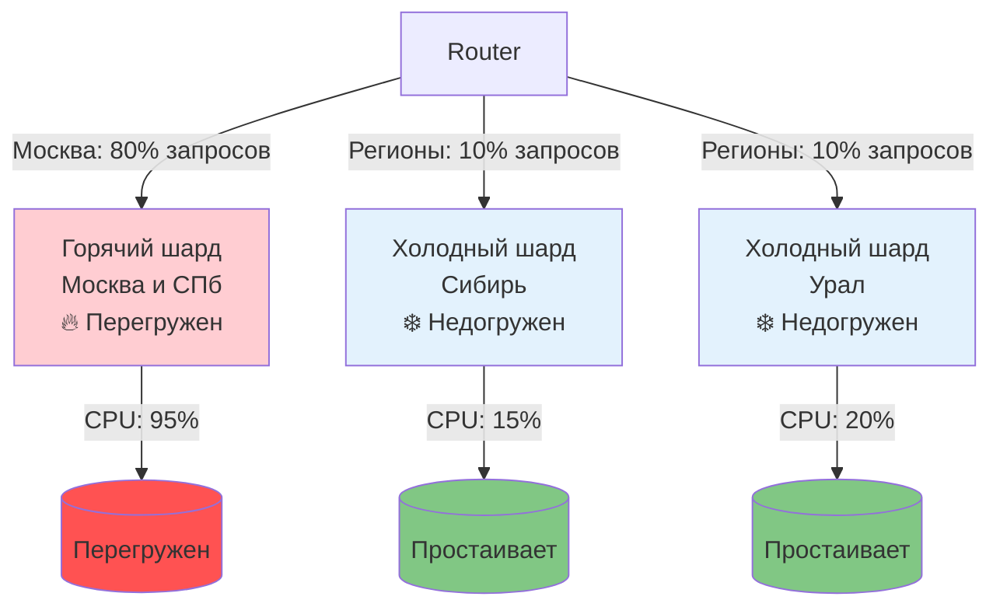
```mermaid
graph TB
    Router[Router] -->|"Москва: 80% запросов"| HotShard[Горячий шард<br/>Москва и СПб<br/>🔥 Перегружен]
    Router -->|"Регионы: 10% запросов"| ColdShard1[Холодный шард<br/>Сибирь<br/>❄️ Недогружен]
    Router -->|"Регионы: 10% запросов"| ColdShard2[Холодный шард<br/>Урал<br/>❄️ Недогружен]
    
    HotShard -->|"CPU: 95%"| DB1[(Перегружен)]
    ColdShard1 -->|"CPU: 15%"| DB2[(Простаивает)]
    ColdShard2 -->|"CPU: 20%"| DB3[(Простаивает)]
    
    style HotShard fill:#ffcdd2
    style ColdShard1 fill:#e3f2fd
    style ColdShard2 fill:#e3f2fd
    style DB1 fill:#ff5252
    style DB2 fill:#81c784
    style DB3 fill:#81c784
```

**❌ Плохо:**
- Шардировать без необходимости — усложняет архитектуру и код
- Выбирать плохой ключ шардирования → «горячие» шарды перегружены

**✅ Хорошо:**
- Делать, когда вертикальное масштабирование уже не помогает
- Выбирать ключ, равномерно распределяющий нагрузку (например, user_id с хэшированием)

### 📊 Количественные Trade-offs (AWS Case Study 2024)

**Неравномерное шардирование:**
- **1 горячий шард на 80% CPU** vs остальные на 20% CPU
- **Downtime риск увеличивается на 35%** (данные AWS RDS)
- **Стоимость инфраструктуры +25%** (переплата за недоиспользованные ресурсы)
- **Latency P95: 2.5 секунды** vs 150ms при равномерном распределении

**Cross-shard запросы:**
- **Latency увеличивается в N раз** (где N = количество шардов)
- **Network overhead: +40%** трафика между шардами
- **Query complexity: 10x** больше кода для агрегации результатов

**Миграция при росте:**
- **Reharding 1TB данных: 4-6 часов** downtime без consistent hashing
- **С consistent hashing: 0 downtime**, но 2-3 дня фоновой миграции

### 🎯 Вопросы-ловушки:

**Q:** "У тебя шардирование по user_id, нужно показать топ-10 самых активных клиентов. Как быть?"
**A:** Cross-shard запрос неизбежен. Варианты: агрегирующий сервис, который собирает топ-10 с каждого шарда и мержит; или отдельная аналитическая БД с репликацией всех данных.

**Q:** "Новый шард добавили, как перебалансировать данные без остановки сервиса?"
**A:** Consistent hashing + постепенная миграция: новый шард начинает принимать только новые записи, старые данные переносятся в фоне batch'ами с проверкой консистентности.

**Q:** "Почему шардирование по географии плохо для российских банков?"
**A:** Неравномерность: Москва и СПб — огромная нагрузка, регионы — мало. Лучше по user_id hash или комбинированный ключ (регион + hash).

### 💭 Дискуссионные вопросы для глубокого анализа

**🔹 Вопрос 1: Geo vs User_ID шардирование**
> **Дебат**: "Шардирование по user_id vs географии: в каком сценарии geo выигрывает?"
> 
> **Подсказка**: Подумайте о latency в multi-region развертывании vs compliance требованиях. Например, GDPR требует хранение данных EU граждан в EU.
> 
> **Ваши мысли**: _[Запишите свою аргументацию]_

**🔹 Вопрос 2: Hot shard перебалансировка**
> **Сценарий**: "У вас горячий шард на 90% CPU, остальные на 20%. Как быстро перебалансировать без downtime?"
>
> **Варианты для дебата**: 
> - Consistent hashing с постепенной миграцией
> - Read replicas для горячего шарда  
> - Вертикальное масштабирование горячего шарда
> - Изменение ключа шардирования
>
> **Ваши мысли**: _[Какой подход выберете и почему?]_

**🔹 Вопрос 3: Trade-off в cross-shard транзакциях**
> **Дилемма**: "Аналитика требует агрегации по всем шардам. Как балансировать между performance и data consistency?"
>
> **Подсказка**: Рассмотрите eventual consistency для аналитики vs strict consistency для транзакций.
>
> **Ваши мысли**: _[Опишите свою стратегию]_

### 🏢 Real-World кейс: Тинькофф vs Сбербанк

**Тинькофф approach** (Digital-first):
- Шардирование по customer_id с hash функцией  
- Microservices архитектура с независимыми шардами
- Kubernetes auto-scaling для балансировки нагрузки

**Сбербанк approach** (Legacy + Modern):
- Hybrid: географическое шардирование для legacy систем
- Customer_id шардирование для новых digital сервисов  
- Постепенная миграция данных между подходами

**Для дискуссии**: Какой подход лучше для банка с 50M клиентов? Учтите legacy constraints и regulatory требования.

---

## 4. 📂 Партиционирование

**Что это:** Разделение одной таблицы на логические сегменты (партиции) внутри одной базы.

**❌ Плохо:**
- Делать слишком много маленьких партиций → накладные расходы
- Не учитывать, что запросы, затрагивающие все партиции, теряют выгоду

**✅ Хорошо:**
- Партиционировать по дате для исторических данных
- Использовать партиционирование для ускорения удаления старых данных (drop partition)

### 🎯 Вопросы-ловушки:

**Q:** "Транзакции за последний год занимают 500GB. Как партиционировать?"
**A:** По месяцам: 12 партиций ~40GB каждая. Позволяет быстро удалять старые данные, запросы за период работают только с нужными партициями. Не по дням (слишком много) и не по кварталам (слишком большие).

**Q:** "Запрос без условия по дате будет сканировать все партиции. Как оптимизировать?"
**A:** Partition pruning не работает. Варианты: добавить обязательное условие по дате в приложении, создать summary таблицу для агрегатов, или гибридный индекс через все партиции.

**Q:** "Можно ли менять partition key на живой системе?"
**A:** В большинстве БД нельзя без recreate таблицы. Нужно планировать заранее. Если нужно — создать новую партиционированную таблицу, dual write, переключить чтение, удалить старую.

---

## 5. ⚖️ Балансировка нагрузки

**Что это:** Распределение запросов между серверами, чтобы ни один не перегружался.

### 📊 Load Balancer с health checks

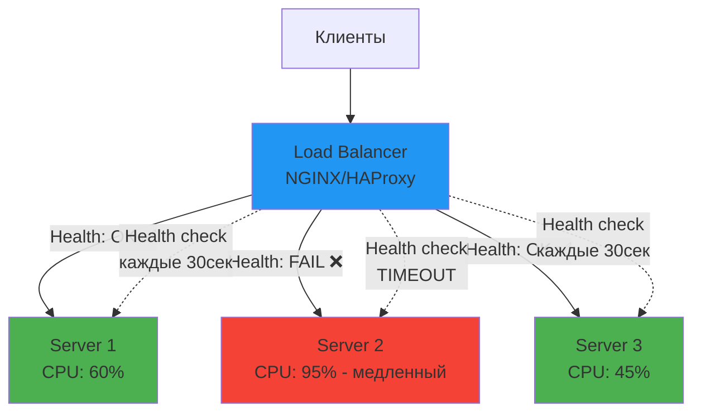
```mermaid
graph TB
    Client[Клиенты] --> LB[Load Balancer<br/>NGINX/HAProxy]
    
    LB -->|"Health: OK ✅"| Server1[Server 1<br/>CPU: 60%]
    LB -->|"Health: FAIL ❌"| Server2[Server 2<br/>CPU: 95% - медленный]
    LB -->|"Health: OK ✅"| Server3[Server 3<br/>CPU: 45%]
    
    LB -.->|"Health check<br/>каждые 30сек"| Server1
    LB -.->|"Health check<br/>TIMEOUT"| Server2
    LB -.->|"Health check<br/>каждые 30сек"| Server3
    
    style Server1 fill:#4caf50
    style Server2 fill:#f44336
    style Server3 fill:#4caf50
    style LB fill:#2196f3
```

### 📊 Weighted Round Robin

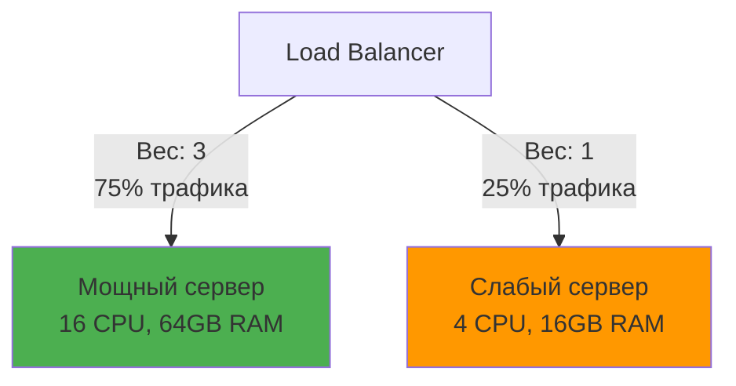
```mermaid
graph TB
    LB[Load Balancer] -->|"Вес: 3<br/>75% трафика"| PowerServer[Мощный сервер<br/>16 CPU, 64GB RAM]
    LB -->|"Вес: 1<br/>25% трафика"| WeakServer[Слабый сервер<br/>4 CPU, 16GB RAM]
    
    style PowerServer fill:#4caf50
    style WeakServer fill:#ff9800
```

**❌ Плохо:**
- Балансировать только по количеству запросов, игнорируя их «тяжесть»
- Не иметь health-check'ов → трафик идёт на мёртвый сервер

**✅ Хорошо:**
- Использовать умные балансировщики (NGINX, HAProxy) с проверкой состояния
- Учитывать latency и CPU при распределении

### 📊 Количественные Trade-offs (Netflix Chaos Engineering 2024)

**Health Check частота:**
- **Каждые 5 секунд**: Быстрое обнаружение сбоев, но +2% network overhead
- **Каждые 30 секунд**: Стандартная практика, TTD (Time To Detect) ~45 секунд
- **Каждые 60+ секунд**: TTD >90 секунд, потеря 5-10% запросов при сбое

**Load Balancing алгоритмы:**
- **Round Robin**: Простой, но неэффективен при разной производительности серверов
- **Weighted Round Robin**: +25% efficiency при heterogeneous infrastructure
- **Least Connections**: +40% performance при long-lived connections
- **Consistent Hashing**: 99.9% cache hit rate после добавления новых серверов

**Session Affinity trade-offs:**
- **Sticky Sessions**: +20% memory usage, -25% fault tolerance
- **Stateless + External Session**: +15% latency, +99% fault tolerance
- **Hybrid Approach**: Оптимальный баланс для большинства случаев

### 🎯 Вопросы-ловушки:

**Q:** "У тебя 3 сервера: 2 мощных, 1 слабый. Как распределить нагрузку?"
**A:** Weighted round-robin: мощным серверам вес 3, слабому вес 1. Итого мощные получат 75% трафика, слабый 25%. Или least connections с учетом capacity каждого сервера.

**Q:** "Один сервер начал отвечать медленно, но не падать. Как детектировать?"
**A:** Health check не только на доступность, но и на latency: если ответ >500ms, считать сервер нездоровым. Circuit breaker: после N медленных ответов исключать сервер на время.

**Q:** "Session affinity нужна или нет для банковского приложения?"
**A:** Лучше без неё — stateless приложение. Все состояние в БД/кэше. Если session нужен, то distributed session (Redis) вместо sticky sessions, чтобы при падении сервера не терять пользователей.

---

## 6. 🚀 Кэширование

**Что это:** Хранение часто используемых данных в быстрой памяти (Redis, Memcached).

### 📊 Multi-layer кэширование

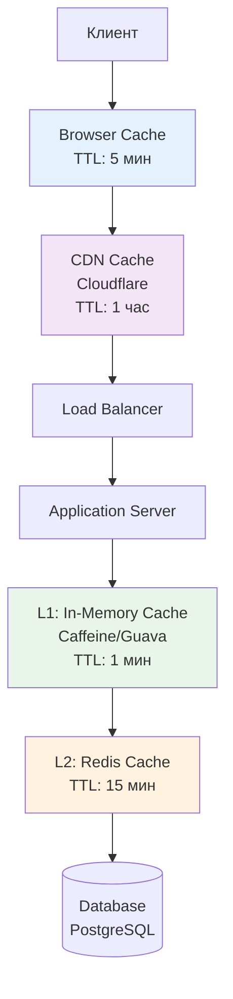
```mermaid
graph TB
    Client[Клиент] --> Browser[Browser Cache<br/>TTL: 5 мин]
    Browser --> CDN[CDN Cache<br/>Cloudflare<br/>TTL: 1 час]
    CDN --> LB[Load Balancer]
    LB --> App[Application Server]
    
    App --> L1[L1: In-Memory Cache<br/>Caffeine/Guava<br/>TTL: 1 мин]
    L1 --> L2[L2: Redis Cache<br/>TTL: 15 мин]
    L2 --> DB[(Database<br/>PostgreSQL)]
    
    style Browser fill:#e3f2fd
    style CDN fill:#f3e5f5
    style L1 fill:#e8f5e8
    style L2 fill:#fff3e0
```

### 📊 Cache Stampede Problem

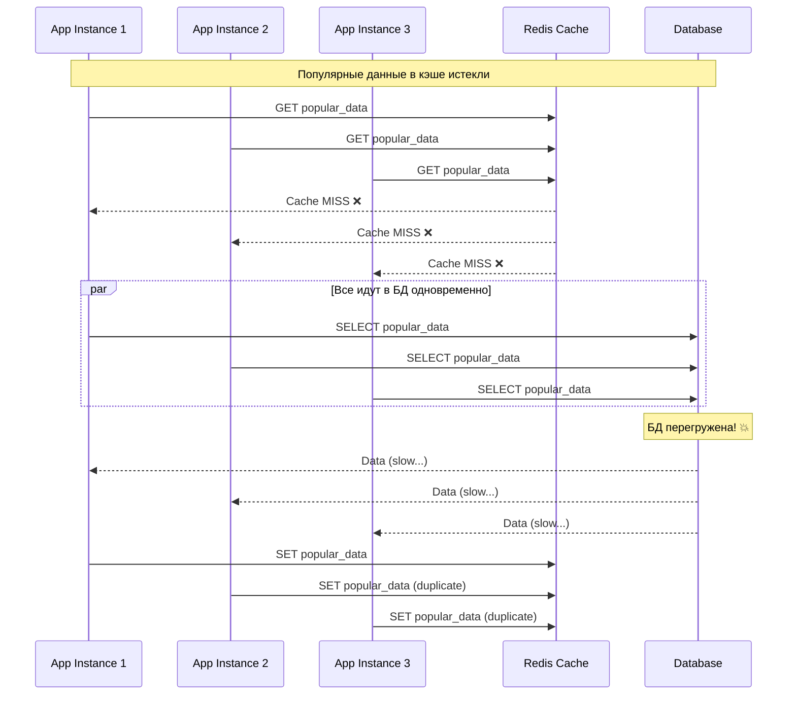
```mermaid
sequenceDiagram
    participant App1 as App Instance 1
    participant App2 as App Instance 2  
    participant App3 as App Instance 3
    participant Redis as Redis Cache
    participant DB as Database
    
    Note over App1,DB: Популярные данные в кэше истекли
    
    App1->>Redis: GET popular_data
    App2->>Redis: GET popular_data
    App3->>Redis: GET popular_data
    
    Redis-->>App1: Cache MISS ❌
    Redis-->>App2: Cache MISS ❌
    Redis-->>App3: Cache MISS ❌
    
    par Все идут в БД одновременно
        App1->>DB: SELECT popular_data
        App2->>DB: SELECT popular_data  
        App3->>DB: SELECT popular_data
    end
    
    Note over DB: БД перегружена! 💥
    
    DB-->>App1: Data (slow...)
    DB-->>App2: Data (slow...)
    DB-->>App3: Data (slow...)
    
    App1->>Redis: SET popular_data
    App2->>Redis: SET popular_data (duplicate)
    App3->>Redis: SET popular_data (duplicate)
```

### 📊 Single-Flight Pattern решение

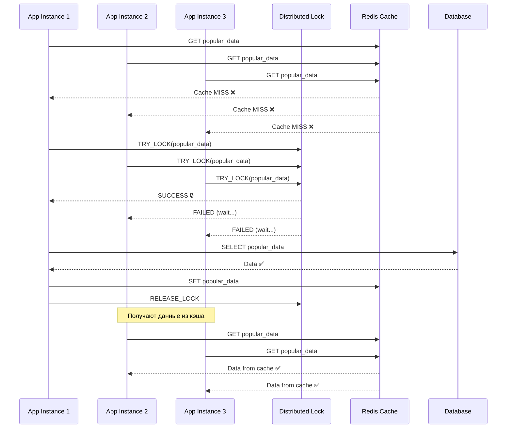
```mermaid
sequenceDiagram
    participant App1 as App Instance 1
    participant App2 as App Instance 2
    participant App3 as App Instance 3
    participant Lock as Distributed Lock
    participant Redis as Redis Cache
    participant DB as Database
    
    App1->>Redis: GET popular_data
    App2->>Redis: GET popular_data
    App3->>Redis: GET popular_data
    
    Redis-->>App1: Cache MISS ❌
    Redis-->>App2: Cache MISS ❌
    Redis-->>App3: Cache MISS ❌
    
    App1->>Lock: TRY_LOCK(popular_data)
    App2->>Lock: TRY_LOCK(popular_data)
    App3->>Lock: TRY_LOCK(popular_data)
    
    Lock-->>App1: SUCCESS 🔒
    Lock-->>App2: FAILED (wait...)
    Lock-->>App3: FAILED (wait...)
    
    App1->>DB: SELECT popular_data
    DB-->>App1: Data ✅
    App1->>Redis: SET popular_data
    App1->>Lock: RELEASE_LOCK
    
    Note over App2,App3: Получают данные из кэша
    App2->>Redis: GET popular_data
    App3->>Redis: GET popular_data
    Redis-->>App2: Data from cache ✅
    Redis-->>App3: Data from cache ✅
```

**❌ Плохо:**
- Кэшировать всё подряд → память забита мусором
- Не инвалидировать кэш при изменении данных → устаревшие ответы

**✅ Хорошо:**
- Кэшировать только «дорогие» запросы
- Настраивать TTL и стратегию обновления (write-through, write-back)

---

## 7. 🌍 CDN

**Что это:** Сеть серверов, раздающих статический контент ближе к пользователю.

### 📊 Global CDN Distribution

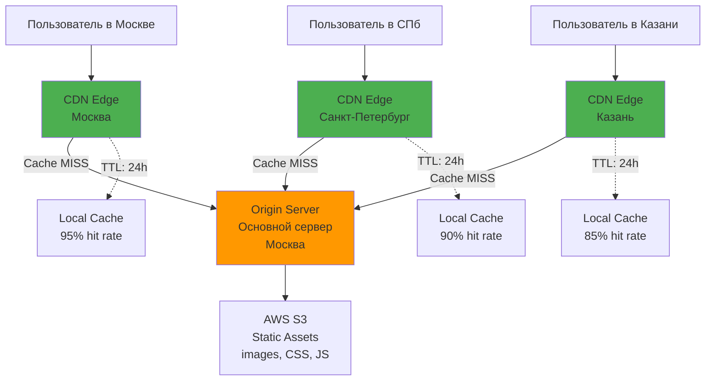
```mermaid
graph TB
    User1[Пользователь в Москве] --> Edge1[CDN Edge<br/>Москва]
    User2[Пользователь в СПб] --> Edge2[CDN Edge<br/>Санкт-Петербург]
    User3[Пользователь в Казани] --> Edge3[CDN Edge<br/>Казань]
    
    Edge1 -->|"Cache MISS"| Origin[Origin Server<br/>Основной сервер<br/>Москва]
    Edge2 -->|"Cache MISS"| Origin
    Edge3 -->|"Cache MISS"| Origin
    
    Origin --> S3[AWS S3<br/>Static Assets<br/>images, CSS, JS]
    
    Edge1 -.-> |TTL: 24h| Edge1Cache[Local Cache<br/>95% hit rate]
    Edge2 -.-> |TTL: 24h| Edge2Cache[Local Cache<br/>90% hit rate]
    Edge3 -.-> |TTL: 24h| Edge3Cache[Local Cache<br/>85% hit rate]
    
    style Edge1 fill:#4caf50
    style Edge2 fill:#4caf50
    style Edge3 fill:#4caf50
    style Origin fill:#ff9800
```

### 📊 Cache Busting Strategy

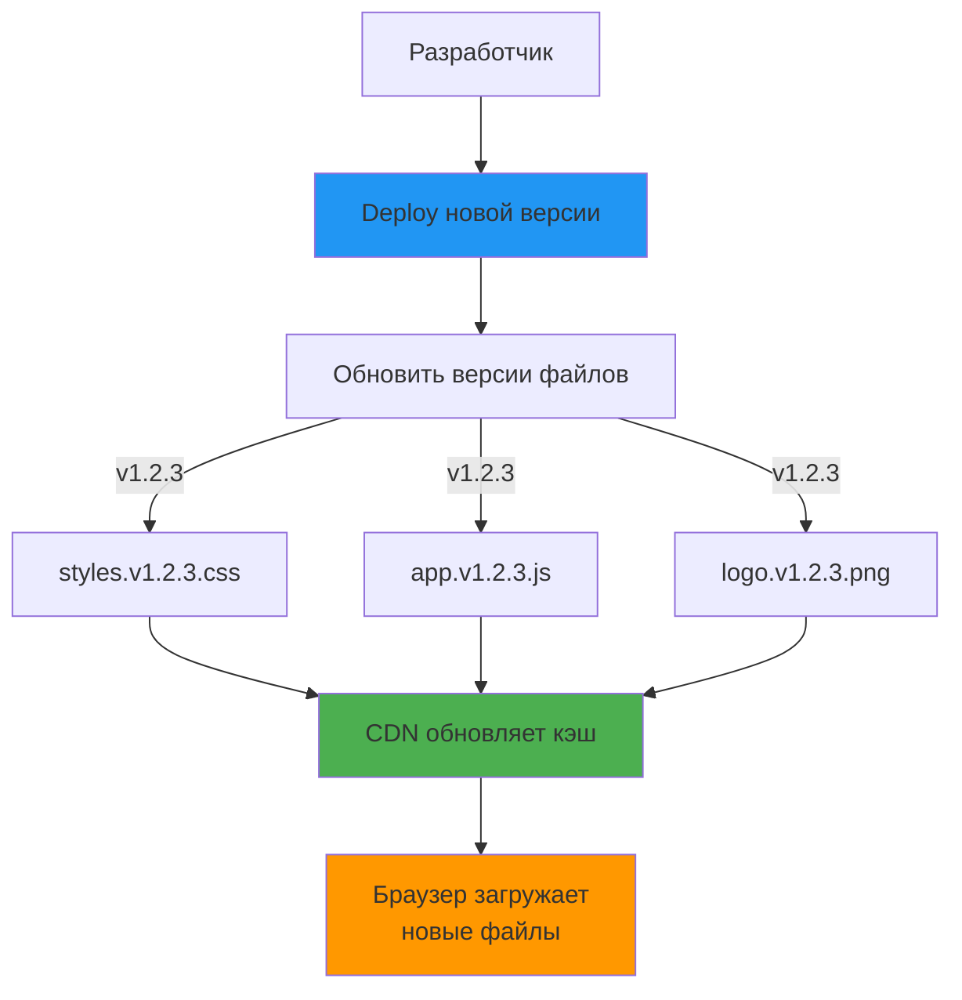
```mermaid
graph TD
    Developer[Разработчик] --> Deploy[Deploy новой версии]
    Deploy --> Version[Обновить версии файлов]
    
    Version -->|"v1.2.3"| CSS[styles.v1.2.3.css]
    Version -->|"v1.2.3"| JS[app.v1.2.3.js]
    Version -->|"v1.2.3"| IMG[logo.v1.2.3.png]
    
    CSS --> CDN[CDN обновляет кэш]
    JS --> CDN
    IMG --> CDN
    
    CDN --> Browser[Браузер загружает<br/>новые файлы]
    
    style Deploy fill:#2196f3
    style CDN fill:#4caf50
    style Browser fill:#ff9800
```

**❌ Плохо:**
- Не использовать CDN для глобальных пользователей → медленная загрузка
- Не обновлять кэш CDN при изменении файлов

**✅ Хорошо:**
- Настроить версионирование файлов (cache busting)
- Использовать HTTPS и сжатие

### 🎯 Вопросы-ловушки:

**Q:** "Курс валют кэшируешь на 5 минут. Что если он резко изменился?"
**A:** Событийная инвалидация: при получении нового курса от ЦБ сразу обновлять кэш. Cache-aside pattern: проверять timestamp последнего обновления, если курс критически устарел — форсированно обновлять.

**Q:** "10000 запросов одновременно к кэшу, miss. Как избежать stampede?"
**A:** Lock-based approach: первый запрос блокирует ключ и идет в БД, остальные ждут. Или probabilistic refresh: обновлять кэш за N секунд до истечения TTL с вероятностью.

**Q:** "Можно ли кэшировать баланс счета клиента?"
**A:** Очень осторожно. Только read-only операции с коротким TTL (секунды). Любая операция списания должна инвалидировать кэш. Лучше кэшировать агрегаты (сумма по всем счетам), а не точный баланс.

### 💭 Дискуссионные вопросы для глубокого анализа

**🔹 Вопрос 1: Cache vs Database consistency**
> **Дебат**: "Cache stampede при 100k RPS: single-flight pattern vs pre-warming vs circuit breaker?"
> 
> **Подсказка**: Каждый подход имеет trade-offs. Single-flight = задержка для concurrent requests, pre-warming = resource waste, circuit breaker = temporary degradation.
> 
> **Ваши мысли**: _[Какую стратегию выберете для Black Friday?]_

**🔹 Вопрос 2: Multi-layer кэширование приоритеты**
> **Сценарий**: "Browser (5 мин) → CDN (1 час) → L1 (1 мин) → L2 (15 мин). Как обеспечить consistency при критичном обновлении цен?"
>
> **Варианты для дебата**: 
> - Cascade invalidation (медленно, но надежно)
> - Versioned cache keys (быстро, но сложность)
> - Event-driven invalidation (scalable, но eventual consistency)
> - Manual cache bust (быстро, но требует process)
>
> **Ваши мысли**: _[Опишите свою стратегию invalidation]_

**🔹 Вопрос 3: Персональный кэш vs Общий кэш**
> **Дилемма**: "Рекомендации для 10M пользователей: кэшировать персональные данные или общие паттерны?"
>
> **Подсказка**: Персональный кэш = better UX, но explosive memory growth. Общий кэш = memory efficient, но generic recommendations.
>
> **Ваши мысли**: _[Как найти баланс между personalization и scale?]_

### 🏢 Реальный кейс: Решение проблемы cache stampede от Amazon

**Проблема**: Миллионы запросов к популярным товарам во время флеш-распродаж.  
**Решение Amazon** (AWS re:Invent 2024):  
- **S3 + CloudFront**: Статический контент (изображения, описания) с TTL 24 часа.  
- **DynamoDB с consistent reads**: Для актуальных данных о запасах на складе.  
- **ElastiCache кластеры**: Read replicas в каждом регионе для масштабирования кэша.  
- **Предиктивный прогрев кэша**: ML-алгоритмы прогнозируют популярные товары на основе исторических данных и трендов.  

**Результат**: 99.9% cache hit rate при нагрузке 1M+ RPS.  

**Для дискуссии**:  
- Какой подход лучше: прогрев кэша на основе ML или single-flight pattern для минимизации нагрузки на БД?  
- Учитывайте: ML требует ресурсов и может дать false positives, single-flight проще, но менее гибкий.  
- **Ваши мысли**: _[Запишите аргументы: например, ML-прогрев лучше для предсказуемых распродаж, single-flight — для непредсказуемых пиков]_  

**Для дискуссии**: Можно ли адаптировать Amazon подход для smaller e-commerce? Какие компоненты критичны vs nice-to-have?

---

## 7. 🌍 CDN

**Что это:** Сеть серверов, раздающих статический контент ближе к пользователю.

**❌ Плохо:**
- Не использовать CDN для глобальных пользователей → медленная загрузка
- Не обновлять кэш CDN при изменении файлов

**✅ Хорошо:**
- Настроить версионирование файлов (cache busting)
- Использовать HTTPS и сжатие

### 🎯 Вопросы-ловушки:

**Q:** "Обновил CSS, но пользователи видят старый дизайн. Решение?"
**A:** Cache busting: добавлять hash или версию к имени файла (styles.v123.css). При деплое новая версия, браузер скачает новый файл. Или Cache-Control: no-cache для критичных файлов.

**Q:** "CDN полезен для мобильного банка в России?"
**A:** Да, для статики (изображения, JS, CSS). Уменьшает latency из регионов, снижает нагрузку на сервера. Но API запросы с персональными данными должны идти напрямую в банк.

**Q:** "Как кэшировать изображения документов с соблюдением безопасности?"
**A:** Не кэшировать в публичном CDN. Использовать private CDN с авторизацией, signed URLs с коротким TTL, или edge computing для проверки прав доступа.

---

## 8. 🏗 Монолит vs Микросервисы

**Что это:**
- **Монолит** — всё в одном приложении
- **Микросервисы** — набор независимых сервисов

### 📊 Микросервисная архитектура с API Gateway

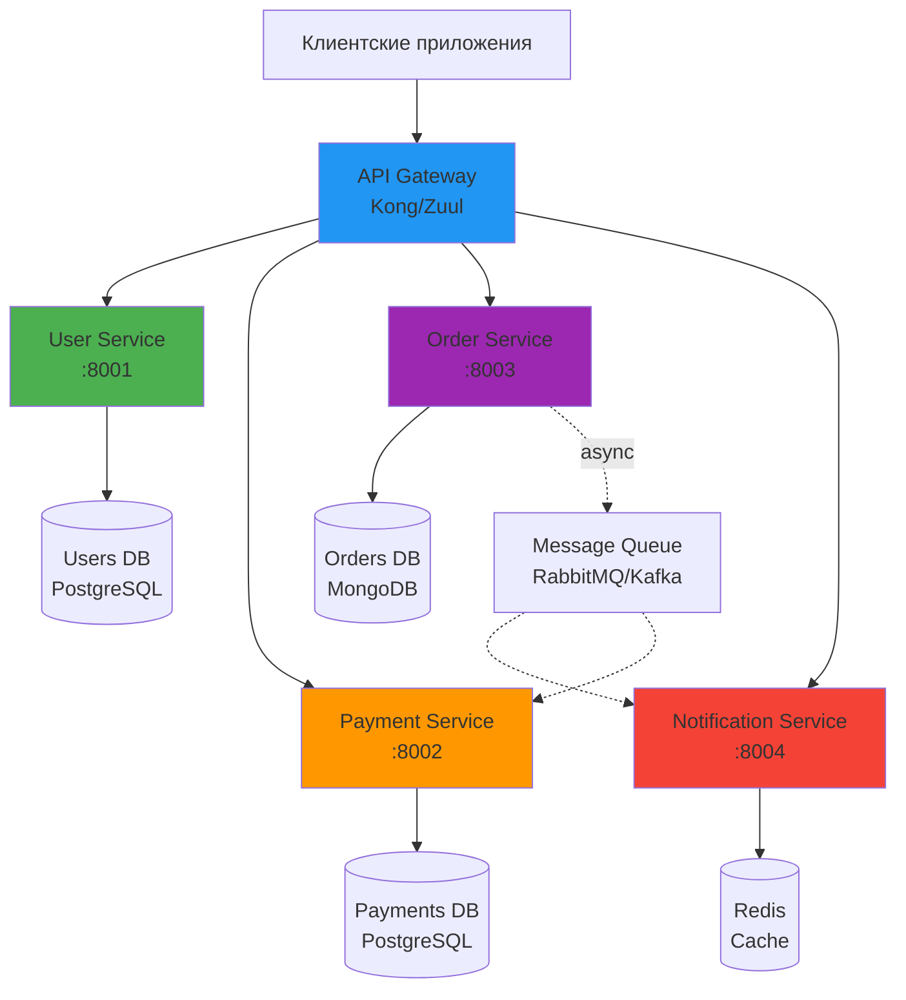
```mermaid
graph TB
    Client[Клиентские приложения] --> Gateway[API Gateway<br/>Kong/Zuul]
    
    Gateway --> UserService[User Service<br/>:8001]
    Gateway --> PaymentService[Payment Service<br/>:8002]  
    Gateway --> OrderService[Order Service<br/>:8003]
    Gateway --> NotificationService[Notification Service<br/>:8004]
    
    UserService --> UserDB[(Users DB<br/>PostgreSQL)]
    PaymentService --> PaymentDB[(Payments DB<br/>PostgreSQL)]
    OrderService --> OrderDB[(Orders DB<br/>MongoDB)]
    NotificationService --> Redis[(Redis<br/>Cache)]
    
    OrderService -.-> |async| Queue[Message Queue<br/>RabbitMQ/Kafka]
    Queue -.-> NotificationService
    Queue -.-> PaymentService
    
    style Gateway fill:#2196f3
    style UserService fill:#4caf50
    style PaymentService fill:#ff9800
    style OrderService fill:#9c27b0
    style NotificationService fill:#f44336
```

### 📊 Circuit Breaker Pattern

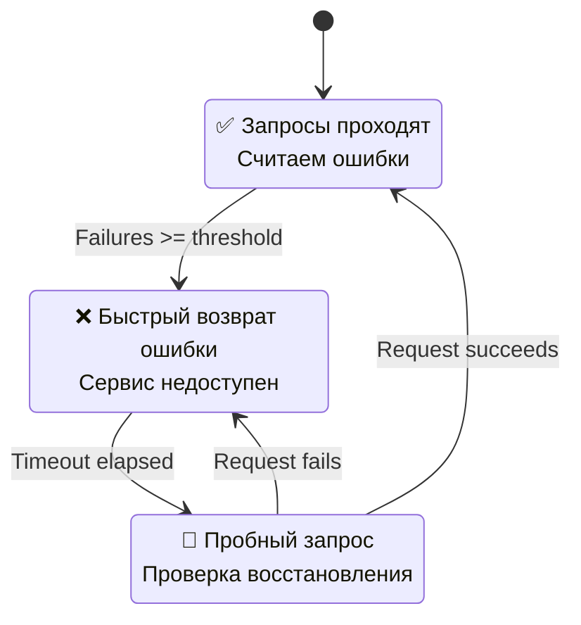
```mermaid
stateDiagram-v2
    [*] --> Closed
    Closed --> Open : Failures >= threshold
    Open --> HalfOpen : Timeout elapsed
    HalfOpen --> Closed : Request succeeds
    HalfOpen --> Open : Request fails
    
    Closed : ✅ Запросы проходят<br/>Считаем ошибки
    Open : ❌ Быстрый возврат ошибки<br/>Сервис недоступен
    HalfOpen : 🔄 Пробный запрос<br/>Проверка восстановления
```

### 📊 Distributed Tracing

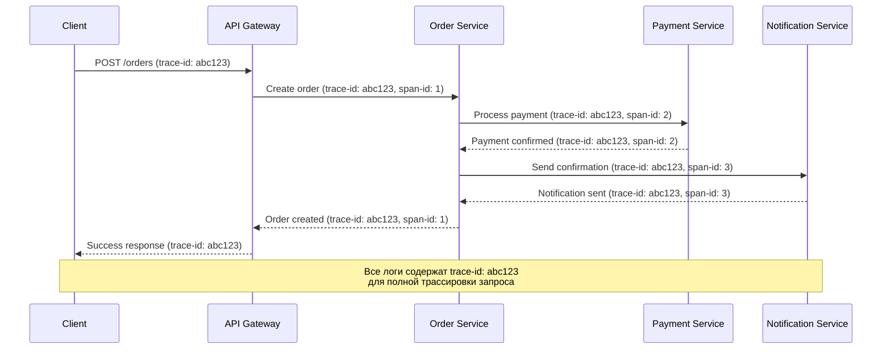
```mermaid
sequenceDiagram
    participant Client
    participant Gateway as API Gateway
    participant Order as Order Service
    participant Payment as Payment Service  
    participant Notification as Notification Service
    
    Client->>Gateway: POST /orders (trace-id: abc123)
    Gateway->>Order: Create order (trace-id: abc123, span-id: 1)
    Order->>Payment: Process payment (trace-id: abc123, span-id: 2)
    Payment-->>Order: Payment confirmed (trace-id: abc123, span-id: 2)
    Order->>Notification: Send confirmation (trace-id: abc123, span-id: 3)
    Notification-->>Order: Notification sent (trace-id: abc123, span-id: 3)
    Order-->>Gateway: Order created (trace-id: abc123, span-id: 1)
    Gateway-->>Client: Success response (trace-id: abc123)
    
    Note over Client,Notification: Все логи содержат trace-id: abc123<br/>для полной трассировки запроса
```

**❌ Плохо:**
- Переходить на микросервисы без зрелой DevOps-культуры → хаос в деплое и коммуникациях
- Монолит без модульности → сложно поддерживать

**✅ Хорошо:**
- Монолит на старте, микросервисы при росте и необходимости масштабирования отдельных частей
- Чёткие API и контрактное тестирование

### 🎯 Вопросы-ловушки:

**Q:** "Команда 5 человек, стартап-банк. Монолит или микросервисы?"
**A:** Однозначно монолит. Микросервисы требуют зрелых DevOps процессов, которых у маленькой команды нет. Модульный монолит с четкими границами — потом легко выделить в сервисы.

**Q:** "У тебя 200 микросервисов, один упал. Как обеспечить resilience?"
**A:** Circuit breaker, timeouts, retry с exponential backoff. Graceful degradation: если сервис рекомендаций упал, показывать дефолтные предложения. Async processing через очереди где возможно.

**Q:** "Как обновить API контракт между сервисами без breaking changes?"
**A:** Versioning API (/v1/, /v2/), backward compatibility (новые поля опциональны), contract testing, blue-green deployment с постепенным переключением трафика.

### 💭 Дискуссионные вопросы для глубокого анализа

**🔹 Вопрос 1: Монолит vs Микросервисы timing**
> **Дебат**: "Startup с 10 разработчиками: когда переходить с монолита на микросервисы?"
> 
> **Подсказка**: Рассмотрите Conway's Law, DevOps maturity, business complexity. Amazon правило: "2-pizza teams" = ~8 человек max на сервис.
> 
> **Ваши мысли**: _[При каких сигналах вы инициируете переход?]_

**🔹 Вопрос 2: Service mesh vs API Gateway**
> **Сценарий**: "50 микросервисов, сложная маршрутизация и security. Istio service mesh vs Kong API Gateway?"
>
> **Trade-offs для дебата**: 
> - Service mesh: лучше observability, но operational complexity  
> - API Gateway: проще в setup, но single point of failure
> - Hybrid: Gateway для external, mesh для internal
>
> **Ваши мысли**: _[Какой критерий решающий для выбора?]_

**🔹 Вопрос 3: Data consistency в микросервисах**
> **Дилемма**: "Order Service упал после payment, но до inventory update. Saga vs 2PC vs Event Sourcing?"
>
> **Подсказка**: В банках предпочитают 2PC (consistency first), в e-commerce — Saga (availability first), в audit-heavy — Event Sourcing.
>
> **Ваши мысли**: _[Как industry context влияет на выбор?]_

Перевод действительно выглядит немного корявым, особенно в терминах и стиле — чувствуется машинный налёт, а для такого технического текста важна чёткость и естественность. Я переведу раздел "Real-World кейс: Тинькофф Digital Bank Architecture" заново, сохранив суть, но сделав текст более профессиональным, лаконичным и в духе русского tech-сообщества. Также учту контекст для дискуссии, чтобы он звучал как нативный и был готов для собеседований или публикации.

---

### 🏢 Реальный кейс: Архитектура цифрового банка Тинькофф vs Сбербанк

**Тинькофф: путь к микросервисам (2019–2024)**  
- **Этап 1 (2019)**: API Gateway + монолит (гибридный подход для скорости вывода фич).  
- **Этап 2 (2020–2021)**: Выделение ключевых сервисов: платежи, профили пользователей, уведомления.  
- **Этап 3 (2022)**: Переход на событийно-ориентированную архитектуру с Apache Kafka для асинхронной обработки.  
- **Этап 4 (2023–2024)**: Внедрение service mesh (Istio) для улучшения observability и управления трафиком.  

**Сбербанк: эволюция с оглядкой на legacy**  
- **Legacy wrapper**: Монолит интегрирован как сервис в микросервисную экосистему.  
- **Strangler Fig pattern**: Постепенная замена устаревших функций новыми сервисами.  
- **Dual-write период**: 2 года параллельной работы старых и новых систем для миграции данных.  

**Результаты (2024):**  
- **Тинькофф**: 99.9% uptime, деплои ежедневно, latency P95 ~150ms для критичных API.  
- **Сбербанк**: 99.95% uptime, деплои раз в неделю, миграция legacy всё ещё в процессе.  

**Для дискуссии**: Какой подход эффективнее для традиционного банка (incumbent) vs необанка?  
- **Учитывайте**:  
  - Регуляторные требования (ЦБ РФ, ФЗ-115, PCI DSS 4.0).  
  - Ожидания клиентов: необанки — UX и скорость, традиционные банки — надёжность и compliance.  
- **Вопросы для дебатов**:  
  - Стоит ли incumbent банку жертвовать скоростью ради минимизации рисков?  
  - Как балансировать legacy-миграцию с новыми фичами?  
  - Какой подход лучше масштабируется для 50M+ клиентов?  

**Ваши мысли**: _[Запишите аргументы: например, Тинькофф выигрывает в agility, но Сбер — в stability]_  


---

## 9. 🔗 Распределённые транзакции (2PC и Saga)

**Что это:**
- **2PC** — двухфазный коммит, все участники либо коммитят, либо откатывают
- **Saga** — цепочка локальных транзакций с компенсирующими действиями

### 📊 Saga Pattern - Банковский перевод

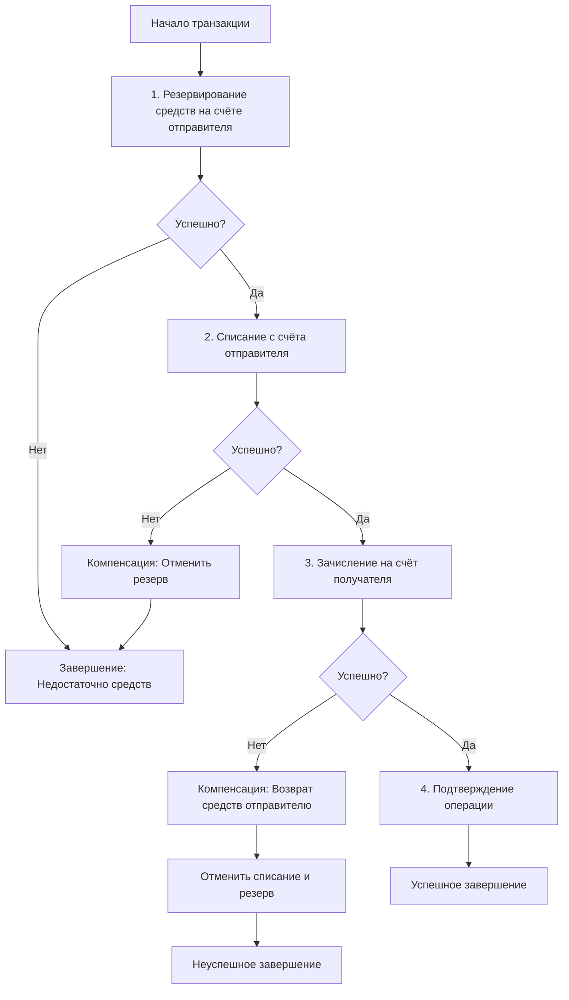
```mermaid
graph TD
    A[Начало транзакции] --> B[1. Резервирование средств на счёте отправителя]
    B --> C{Успешно?}
    C -->|"Да"| D[2. Списание с счёта отправителя]
    C -->|"Нет"| E[Завершение: Недостаточно средств]
    
    D --> F{Успешно?}
    F -->|"Да"| G[3. Зачисление на счёт получателя]
    F -->|"Нет"| H[Компенсация: Отменить резерв]
    
    G --> I{Успешно?}
    I -->|"Да"| J[4. Подтверждение операции]
    I -->|"Нет"| K[Компенсация: Возврат средств отправителю]
    
    H --> E
    K --> L[Отменить списание и резерв]
    J --> M[Успешное завершение]
    L --> N[Неуспешное завершение]
```

### 📊 2PC Pattern - Синхронная репликация

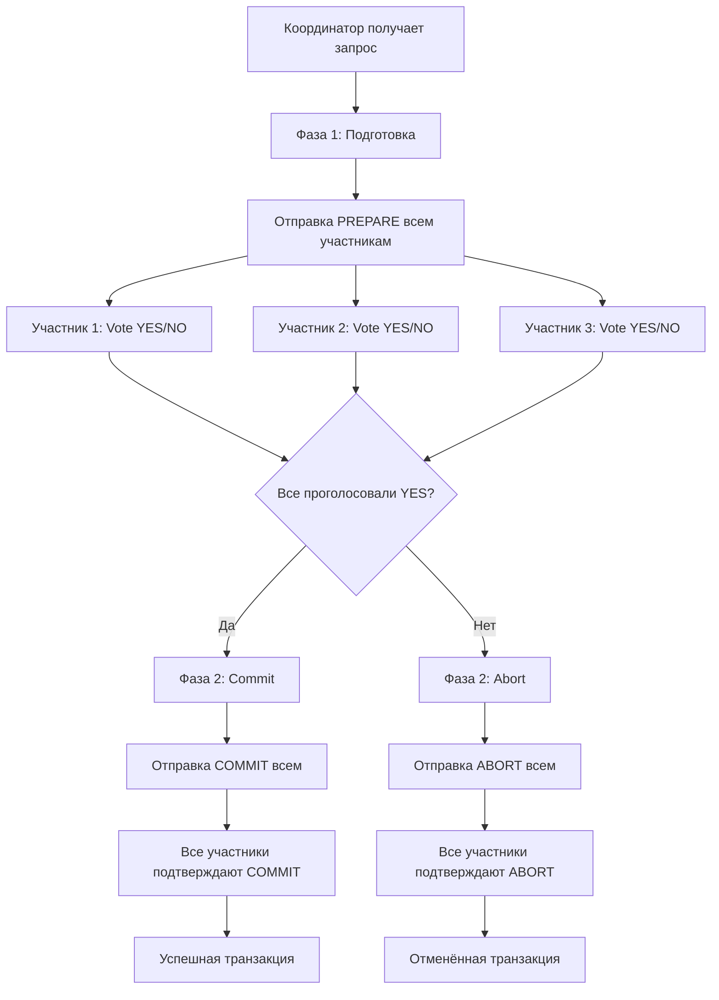
```mermaid
graph TD
    A[Координатор получает запрос] --> B[Фаза 1: Подготовка]
    B --> C[Отправка PREPARE всем участникам]
    C --> D[Участник 1: Vote YES/NO]
    C --> E[Участник 2: Vote YES/NO] 
    C --> F[Участник 3: Vote YES/NO]
    
    D --> G{Все проголосовали YES?}
    E --> G
    F --> G
    
    G -->|"Да"| H[Фаза 2: Commit]
    G -->|"Нет"| I[Фаза 2: Abort]
    
    H --> J[Отправка COMMIT всем]
    I --> K[Отправка ABORT всем]
    
    J --> L[Все участники подтверждают COMMIT]
    K --> M[Все участники подтверждают ABORT]
    
    L --> N[Успешная транзакция]
    M --> O[Отменённая транзакция]
```

**❌ Плохо:**
- 2PC в высоконагруженных системах → блокировки и задержки
- Saga без продуманной компенсации → несогласованные данные

**✅ Хорошо:**
- 2PC — только там, где критична строгая консистентность
- Saga — для асинхронных процессов, где допустима eventual consistency

### 🎯 Вопросы-ловушки:

**Q:** "Перевод между банками: 2PC или Saga?"
**A:** Saga. Банки — независимые системы, 2PC через интернет ненадежен. Схема: резерв → списание → зачисление → подтверждение. Каждый шаг с компенсацией и retry логикой.

**Q:** "В середине Saga упал координатор. Как восстановиться?"
**A:** Event sourcing: все шаги записываются в persistent log. При восстановлении координатор читает log и продолжает с места падения. Каждый шаг должен быть идемпотентным.

**Q:** "Что лучше: блокировка на 10 секунд или eventual consistency?"
**A:** Зависит от операции. Перевод денег — лучше блокировка, но не 2PC, а optimistic locking. Обновление профиля — eventual consistency. В банках чаще жертвуют доступностью ради консистентности.

---

## 10. 📢 Событийно-ориентированная архитектура

**Что это:** Компоненты обмениваются событиями (Kafka, RabbitMQ).

### 📊 Kafka Topic Architecture

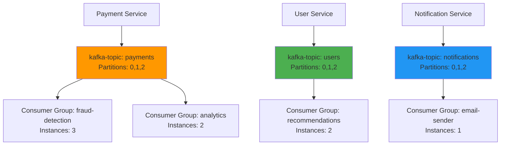
```mermaid
graph TB
    Producer1[Payment Service] --> Topic1[kafka-topic: payments<br/>Partitions: 0,1,2]
    Producer2[User Service] --> Topic2[kafka-topic: users<br/>Partitions: 0,1,2]
    Producer3[Notification Service] --> Topic3[kafka-topic: notifications<br/>Partitions: 0,1,2]
    
    Topic1 --> ConsumerGroup1[Consumer Group: fraud-detection<br/>Instances: 3]
    Topic1 --> ConsumerGroup2[Consumer Group: analytics<br/>Instances: 2]
    
    Topic2 --> ConsumerGroup3[Consumer Group: recommendations<br/>Instances: 2]
    
    Topic3 --> ConsumerGroup4[Consumer Group: email-sender<br/>Instances: 1]
    
    style Topic1 fill:#ff9800
    style Topic2 fill:#4caf50  
    style Topic3 fill:#2196f3
```

### 📊 Event Processing with Partitioning

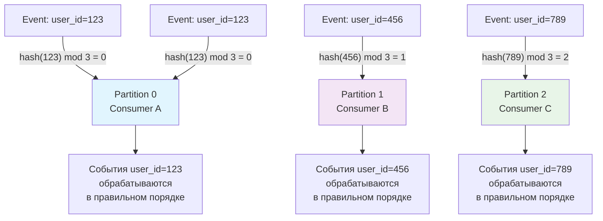
```mermaid
graph TB
    Event1[Event: user_id=123] -->|"hash(123) mod 3 = 0"| Partition0[Partition 0<br/>Consumer A]
    Event2[Event: user_id=456] -->|"hash(456) mod 3 = 1"| Partition1[Partition 1<br/>Consumer B]
    Event3[Event: user_id=789] -->|"hash(789) mod 3 = 2"| Partition2[Partition 2<br/>Consumer C]
    Event4[Event: user_id=123] -->|"hash(123) mod 3 = 0"| Partition0
    
    Partition0 --> Order1[События user_id=123<br/>обрабатываются<br/>в правильном порядке]
    Partition1 --> Order2[События user_id=456<br/>обрабатываются<br/>в правильном порядке]
    Partition2 --> Order3[События user_id=789<br/>обрабатываются<br/>в правильном порядке]
    
    style Partition0 fill:#e1f5fe
    style Partition1 fill:#f3e5f5
    style Partition2 fill:#e8f5e8
```

### 📊 Dead Letter Queue Pattern

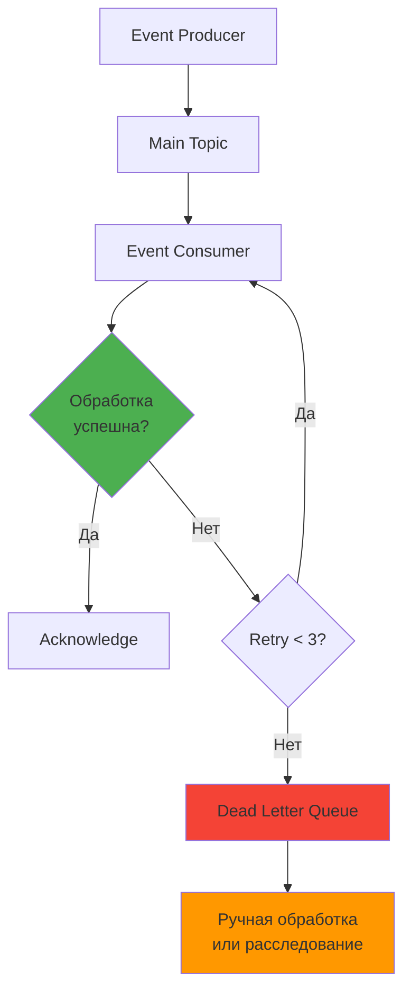
```mermaid
graph TD
    Producer[Event Producer] --> Topic[Main Topic]
    Topic --> Consumer[Event Consumer]
    
    Consumer --> Success{Обработка<br/>успешна?}
    Success -->|"Да"| Complete[Acknowledge]
    Success -->|"Нет"| Retry{Retry < 3?}
    
    Retry -->|"Да"| Consumer
    Retry -->|"Нет"| DLQ[Dead Letter Queue]
    
    DLQ --> Manual[Ручная обработка<br/>или расследование]
    
    style Success fill:#4caf50
    style DLQ fill:#f44336
    style Manual fill:#ff9800
```

**❌ Плохо:**
- Не обрабатывать повторные события → дубликаты в данных
- Слишком много мелких событий → перегрузка брокера

**✅ Хорошо:**
- Идемпотентные обработчики
- Чёткая схема событий и версионирование

### 🎯 Вопросы-ловушки:

**Q:** "Событие 'деньги списаны' пришло дважды. Что делать?"
**A:** Идемпотентность: каждое событие имеет уникальный ID, обработчик проверяет, не обработано ли уже. Дедупликация на уровне Kafka (exactly-once semantics) или в приложении.

**Q:** "Kafka lag растет, обработчики не успевают. Решения?"
**A:** Масштабирование: больше partitions и consumer'ов. Batching: обрабатывать события пачками. Async processing: быстро ack, обработка в background. Priority queues для критичных событий.

**Q:** "Как обеспечить порядок обработки событий одного клиента?"
**A:** Partition key по client_id — все события клиента попадут в одну партицию и будут обработаны по порядку одним consumer'ом. Или sequence number в событиях.

---

## 11. ⚖️ CAP-теорема

**Что это:** В распределённой системе можно одновременно гарантировать только 2 из 3: Consistency, Availability, Partition tolerance.

**❌ Плохо:**
- Игнорировать ограничения CAP → ожидать невозможного

**✅ Хорошо:**
- Осознанно выбирать баланс: банки чаще жертвуют доступностью ради консистентности

### 🎯 Вопросы-ловушки:

**Q:** "Сеть между дата-центрами упала. Какие операции продолжить?"
**A:** CP выбор: блокировать операции записи для сохранения консистентности. Только read-only операции с предупреждением об устаревших данных. Критичные операции (переводы) откладывать до восстановления связи.

**Q:** "ACID vs BASE в банковской системе. Где что применить?"
**A:** ACID для core banking (счета, переводы). BASE для аналитики, рекомендаций, логов. Гибридный подход: ACID локально, eventual consistency между сервисами.

**Q:** "Eventual consistency для банковского баланса — приемлемо?"
**A:** Нет для основного баланса. Но для аналитических витрин, уведомлений, истории операций — да. Главное: клиент всегда видит consistent view своих денег.

---

## 12. 📊 Мониторинг, логирование и трассировка

**Что это:** Инструменты для наблюдения за системой (Prometheus, ELK, Jaeger).

**❌ Плохо:**
- Логировать всё подряд без структуры → сложно искать
- Нет алертов → узнаём о проблемах от клиентов

**✅ Хорошо:**
- Структурированные логи, метрики и распределённый трейсинг
- Настроенные алерты по ключевым метрикам

### 🎯 Вопросы-ловушки:

**Q:** "Транзакция медленная, но ты не знаешь где bottleneck. План действий?"
**A:** Distributed tracing: по trace ID отследить путь запроса через все сервисы. APM tools показывают, где тратится время. Логи с correlation ID для детального анализа. Профилирование кода на подозрительных участках.

**Q:** "1000 алертов в день. Как уменьшить noise?"
**A:** Alert fatigue опасен. Настроить severity levels, только P1/P2 будят ночью. Алерты на симптомы, а не причины. Группировка связанных алертов. Runbook для каждого алерта.

**Q:** "Как детектировать мошеннические операции в real-time?"
**A:** Stream processing (Kafka Streams, Flink): анализ паттернов в реальном времени. ML модели для anomaly detection. Rule engine для известных паттернов. Scoring с threshold'ами для блокировки.

---

## 🎯 Связи между понятиями

В банковской системе все эти технологии работают вместе:
- **Load Balancer** распределяет нагрузку между **микросервисами**
- **Микросервисы** читают из **кэша** и **реплик БД**
- **Шардированная БД** с **индексами** и **партициями**
- **Event-driven** коммуникация через **Saga** паттерны
- **Monitoring** всего этого безобразия 😄

  # 🏦 Банковские System Design: Глубокая логика решений

## 1. 📇 Индексы в банковских системах

### Исходный ответ:
**Q:** "Как бы ты индексировал поле с номером карты для поиска по маске (****1234)?"

**A:** Обычный B-tree индекс не поможет для LIKE '%1234'. Варианты: полнотекстовый поиск, reverse index (индекс по обращенной строке), или отдельное поле с последними 4 цифрами.

### 🤔 Почему обычный B-tree индекс не работает для поиска по окончанию?

**Принцип работы B-tree индекса:**
- B-tree сортирует данные слева направо: 1234567890, 1234567891, 1234567892
- Для поиска LIKE '1234%' индекс быстро найдет все записи, начинающиеся с 1234
- Для поиска LIKE '%1234' индексу нужно просканировать все записи и проверить окончание
- Это превращается в полное сканирование таблицы, что неэффективно

### 🤔 Почему отдельное поле с последними 4 цифрами лучше всего?

**Банковская специфика и безопасность:**
- ЦБ РФ требует маскировать номера карт в логах и интерфейсах
- Отдельное поле last_four_digits позволяет искать без доступа к полному номеру карты
- Соответствие PCI DSS: полный номер карты хранится в зашифрованном виде
- Индекс по 4 цифрам имеет хорошую селективность: 10000 возможных значений

**Производительность и масштабирование:**
- Поиск по 4 символам намного быстрее полнотекстового поиска
- Smaller index size означает больше данных помещается в память
- Concurrent access лучше работает с простыми B-tree индексами

### 🤔 Почему reverse index менее предпочтителен?

**Сложность поддержки:**
- Reverse index требует дополнительной логики в приложении для реверса строк
- При изменении номера карты нужно обновлять как прямой, так и обратный индекс
- Debugging становится сложнее когда данные хранятся в перевернутом виде
- Code review команды становится более трудоемким

---

## 2. 🔄 Репликация в банковских системах

### Исходный ответ:
**Q:** "При каком лаге репликации ты начнешь redirect на master?"

**A:** Зависит от бизнеса. Для баланса — любой лаг критичен. Для истории операций — можно 5-10 секунд.

### 🤔 Почему для баланса любой лаг критичен?

**Регулятивные требования:**
- ЦБ РФ требует мгновенного отражения операций по счету
- ФЗ-115 о противодействии отмыванию денег требует real-time мониторинга операций
- Базельские соглашения предписывают точный учет рисков в реальном времени
- Штрафы за нарушения могут достигать миллионов рублей

**Пользовательское доверие:**
- Клиент видит неактуальный баланс после перевода = звонок в службу поддержки
- Служба поддержки не может объяснить техническую задержку клиенту
- Потеря доверия к банку = отток клиентов к конкурентам
- Репутационные риски в социальных сетях распространяются мгновенно

### 🤔 Почему для истории операций можно допустить задержку?

**Различие в критичности данных:**
- История операций используется для справочной информации
- Клиент обычно проверяет историю не сразу после операции
- 5-10 секунд задержки не влияют на принятие финансовых решений
- Regulatory reporting обычно не требует мгновенной доступности исторических данных

**Экономическая целесообразность:**
- Синхронная репликация истории увеличивает latency критичных операций
- Стоимость дополнительной инфраструктуры не оправдана для некритичных данных
- Асинхронная репликация позволяет использовать batch processing для оптимизации

---

## 3. 🪓 Шардирование в банковских системах

### Исходный ответ:
**Q:** "Почему шардирование по географии плохо для российских банков?"

**A:** Неравномерность: Москва и СПб — огромная нагрузка, регионы — мало.

### 🤔 Почему географическое неравенство критично для банков?

**Статистика распределения клиентов:**
- Москва и Московская область = 15% населения, но 40% банковских операций
- Санкт-Петербург = 3% населения, но 12% операций
- Остальные 82% населения генерируют только 48% операций
- VIP клиенты концентрируются в крупных городах, создавая еще большую неравномерность

**Операционные проблемы:**
- Московский шард будет постоянно перегружен
- Regional shards будут недоиспользованы, но их содержание стоит денег
- Auto-scaling не поможет, так как нельзя переместить данные между географическими шардами
- Backup и disaster recovery становятся асимметричными

### 🤔 Почему user_id hash лучше для банков?

**Равномерное распределение нагрузки:**
- Hash функция обеспечивает статистически равномерное распределение
- Каждый шард получает примерно одинаковое количество активных клиентов
- Load balancing работает предсказуемо
- Capacity planning становится проще

**Банковская специфика:**
- Rich clients распределяются равномерно по всем шардам
- Нет зависимости от географических факторов
- Easier compliance с требованиями хранения данных
- Uniform disaster recovery procedures для всех шардов

---

## 4. 📂 Партиционирование в банковских системах

### Исходный ответ:
**Q:** "Транзакции за последний год занимают 500GB. Как партиционировать?"

**A:** По месяцам: 12 партиций ~40GB каждая.

### 🤔 Почему именно месячные партиции оптимальны для банков?

**Regulatory reporting requirements:**
- ЦБ РФ требует ежемесячную отчетность по операциям
- Monthly partitions align с циклами регулятивной отчетности
- Backup и archiving можно делать по месячным циклам
- Audit процедуры работают с месячными периодами

**Операционная эффективность:**
- 40GB размер партиции позволяет complete backup за 2-3 часа
- Index maintenance на 40GB завершается за ночное окно обслуживания
- Monthly archiving старых данных на cheaper storage
- Recovery procedures можно протестировать на разумных объемах данных

### 🤔 Почему не daily partitions для банковских данных?

### 🤔 Почему управление множеством партиций создаёт проблемы?

**Overhead управления:**
- **365 партиций в год** создают значительную нагрузку на управление метаданными.
- Скрипты для обслуживания базы данных становятся **сложнее**.
- Мониторинг и оповещения нужно настраивать для **сотен партиций**.
- Вероятность **человеческих ошибок** растёт при управлении множеством объектов.

**Performance considerations:**
- Запросы, охватывающие **несколько дней**, требуют обращения к множеству партиций.
- Оптимизация планов запросов **усложняется** для кросс-партиционных запросов.
- Использование памяти для **метаданных** всех партиций увеличивается.
- Окно для **бэкапов** может не уместиться в ночное время.

---

## 5. ⚖️ Балансировка нагрузки в банках

### Исходный ответ:
**Q:** "Session affinity нужна или нет для банковского приложения?"

**A:** Лучше без неё — stateless приложение. Все состояние в БД/кэше.

### 🤔 Почему stateless architecture критична для банков?

### 🤔 Почему важны регуляторные требования и высокая доступность?

**Regulatory compliance:**
- Аудиторы требуют **полной прослеживаемости** всех операций.
- Состояние сессии в памяти сервера **не поддаётся аудиту**.
- Транзакции базы данных обеспечивают **полный аудиторский след**.
- Соответствие международным стандартам требует **постоянного состояния**.

**High availability requirements:**
- Банковские системы должны быть доступны **99.9%+ времени**.
- Сбой сервера с состоянием сессии = **потеря активных пользовательских сессий**.
- **Stateless-серверы** позволяют мгновенно переключаться на другие узлы.
- **Load balancer** может перенаправить трафик без потери состояния.

### 🤔 Почему distributed session в Redis лучше sticky sessions? (Почему важны отказоустойчивость и безопасность)

**Fault tolerance:**
- **Sticky session** привязывает пользователя к конкретному серверу.
- Если сервер падает, пользователь **теряет сессию** и должен заново логиниться.
- **Redis cluster** с репликацией обеспечивает сохранность сессий.
- Множество узлов Redis предотвращают **единичную точку отказа**.

**Security considerations:**
- Банковские правила требуют **сброса сессии** при подозрительной активности.
- Распределённые сессии позволяют **мгновенно аннулировать сессию** на всех серверах.
- Централизованное управление сессиями **упрощает мониторинг безопасности**.
- **Таймаут сессии** можно контролировать централизованно для всех пользователей.

---

## 6. 🚀 Кэширование в банковских системах

### Исходный ответ:
**Q:** Можно ли кэшировать баланс счета клиента?

**A:** Очень осторожно. Только read-only операции с коротким **TTL** (секунды).

### 🤔 Почему кэширование баланса так опасно в банках?

**Financial accuracy requirements:**
- Банковские системы требуют **абсолютной точности** финансовых данных.
- Кэшированный баланс может **устареть** между чтением и операцией списания.
- **Race conditions** между обновлением кэша и транзакцией в базе данных.
- Регуляторные требования **запрещают** показ неточных балансов клиентам.

**Audit trail requirements:**
- Каждое обращение к балансу должно быть **залогировано** для аудита.
- Чтение из кэша **не фиксируется** в аудиторском логе базы данных.
- Аудиторы не могут проследить **source of truth** для показанного баланса.
- Расхождение между кэшированными и реальными данными создаёт **риски несоответствия** требованиям.

### 🤔 Почему агрегаты безопаснее для кэширования?

**Lower precision requirements:**
- **Сумма по всем счетам клиента** менее критична и лучше подходит для кэширования.
- Небольшие расхождения в агрегатах **не влияют** на конкретные операции.
- Агрегаты используются для **дашбордов и аналитики**, а не для транзакционных решений.
- **Допустимый уровень риска** выше для информационных панелей.

**Business logic separation:**
- Агрегированные данные не участвуют в **критически важных бизнес-операциях**.
- Сбои в инвалидации кэша **не блокируют** основные банковские функции.
- **Eventual consistency** приемлема для отчётов и аналитики.
- **Улучшение пользовательского опыта** без регуляторных рисков.

---

## 7. 🌍 CDN в банковских системах

### Исходный ответ:
**Q:** "Как кэшировать изображения документов с соблюдением безопасности?"

**A:** Не кэшировать в публичном CDN. Использовать private CDN с авторизацией.

### 🤔 Почему публичный CDN недопустим для банковских документов?

**Требования по защите данных:**
- ФЗ-152 о персональных данных запрещает передачу личных данных третьим лицам
- GDPR требует контроля над местоположением персональных данных
- Законы о банковской тайне требуют защиты конфиденциальной информации клиентов
- Штрафы за нарушения могут достигать 4% от годового оборота

**Риски безопасности:**
- Публичный CDN означает потерю контроля над данными
- Edge servers могут находиться в юрисдикциях со слабой защитой данных
- Сотрудники третьих лиц получают доступ к чувствительным банковским документам
- Инвалидация кэша в публичном CDN может быть неполной

### 🤔 Почему signed URLs с коротким TTL эффективны?

**Time-limited access control:**
- **Signed URL** действует только ограниченное время (например, **5 минут**).
- После истечения **TTL** документ автоматически становится недоступным.
- Нет риска **долгосрочной утечки**, даже если URL попадёт не в те руки.
- Каждый доступ к документу требует **новой авторизации**.

**Audit capabilities:**
- Каждый **signed URL** генерируется с **уникальным идентификатором**.
- Полный **аудиторский след** фиксирует, кто и когда запрашивал доступ к документу.
- **Автоматическое логирование** всех попыток доступа.
- Сотрудники по соблюдению требований могут **проследить** все обращения к чувствительным данным.

---

## 8. 🏗 Микросервисы в банковских системах

### Исходный ответ:
**Q:** "Команда 5 человек, стартап-банк. Монолит или микросервисы?"

**A:** Однозначно монолит. Микросервисы требуют зрелых DevOps процессов.

### 🤔 Почему зрелые DevOps процессы критичны для банков?

**Требования к формальному управлению изменениями:**
- Каждое изменение в банковской системе должно проходить формальное одобрение (formal approval)
- Процедуры управления изменениями требуют документирования всех зависимостей
- Микросервисы создают множественные точки изменений и зависимости
- Небольшая команда не может обеспечить proper governance (надлежащее управление) для распределенной системы

**Операционная сложность:**
- Банковские системы требуют работы 24/7 с минимальными простоями
- Отладка микросервисов требует сложных инструментов мониторинга и трассировки
- Команда из 5 человек не может обеспечить круглосуточное дежурство для множественных сервисов
- Реагирование на инциденты становится экспоненциально сложнее с распределенной архитектурой

Исходный ответ:
Q: Что лучше: блокировка на 10 секунд или eventual consistency?
A: Зависит от операции. Для перевода денег — лучше блокировка.

🤔 Почему блокировка предпочтительнее для денежных переводов?
Financial integrity requirements:

Банковские правила требуют атомарности для денежных операций.
Двойное списание денег должно быть полностью исключено.
Eventual consistency может привести к временным ситуациям с овердрафтом.
Штрафы за финансовые несоответствия от регуляторов очень высокие.

Customer trust implications:

Клиент ожидает, что перевод сразу отразится на балансе.
Eventual consistency может показать деньги одновременно на двух счетах.
Несоответствия в балансе увеличивают обращения в службу поддержки.
Финансовые ошибки наносят долгосрочный ущерб репутации бренда.

🤔 Почему модульный монолит подходит для стартап-банка?

Simplified compliance:

Единый модуль деплоя упрощает процессы регуляторного одобрения.
Легче формировать аудиторский след, когда все изменения в одном коде.
Процедуры управления изменениями более простые и понятные.
Тестирование и валидация упрощаются в монолитной архитектуре.

Resource efficiency:

Маленькая команда может сосредоточиться на бизнес-логике, а не на сложной инфраструктуре.
Единая транзакция базы данных обеспечивает свойства ACID без сложностей распределённых систем.
Проще управлять консистентностью данных в рамках одной системы.
Меньшие операционные затраты на начальной стадии.


---

## 9. 🔗 Распределённые транзакции в банках

### Исходный ответ:
Q: Что лучше: блокировка на 10 секунд или eventual consistency?
A: Зависит от операции. Для перевода денег — лучше блокировка.
🤔 Почему блокировка предпочтительнее для денежных переводов?

Financial integrity requirements:

Банковские правила требуют атомарности для денежных операций.
Двойное списание денег должно быть полностью исключено.
Eventual consistency может привести к временным ситуациям с овердрафтом.
Штрафы за финансовые несоответствия от регуляторов очень высокие.

Customer trust implications:

Клиент ожидает, что перевод сразу отразится на балансе.
Eventual consistency может показать деньги одновременно на двух счетах.
Несоответствия в балансе увеличивают обращения в службу поддержки.
Финансовые ошибки наносят долгосрочный ущерб репутации бренда.


### 🤔 Почему optimistic locking лучше 2PC для переводов?

**Performance characteristics:**
- **Optimistic locking** не удерживает блокировки до момента коммита.
- **2PC** требует координации между несколькими системами, что может привести к блокировкам.
- Банковские переводы обычно **не вызывают высокого конфликта** на одном счёте.
- Механизм повторных попыток при конфликтах optimistic lock **проще**, чем восстановление 2PC.

**Failure handling:**
- Сбои при **optimistic locking** легко устраняются повторными попытками без сложной координации.
- Сбой координатора в **2PC** может заблокировать несколько счетов.
- Банковские системы требуют **предсказуемых сценариев сбоев**.
- Процедуры восстановления для конфликтов optimistic lock более **простые и понятные**.

---

## 10. 📢 Event-driven архитектура в банках

### Исходный ответ:
**Q:** "Как обеспечить порядок обработки событий одного клиента?"

**A:** Partition key по client_id — все события клиента попадут в одну партицию.

### 🤔 Почему порядок событий так важен в банковских системах?

**Требования аудита:**
- Аудиторы должны видеть все операции клиента в строгом хронологическом порядке.
- Если операции обрабатываются не по порядку, след аудита становится путаным и ненадёжным.
- Для криминалистического анализа нужен точный порядок событий.
- Отчёты для регуляторов должны отражать реальное время операций.

**Зависимости бизнес-логики:**
- Закрытие счёта возможно только после завершения всех незавершённых транзакций.
- Изменения кредитного лимита должны применяться в правильной последовательности.
- Расчёт процентов зависит от порядка операций.
- Оценка рисков требует хронологического обзора активности клиента.

### 🤔 Почему использование одной партиции для клиента не создаёт узкое место?

**Особенности банковских транзакций:**
- Обычные клиенты редко совершают много транзакций за короткое время.
- Большинство операций в банке инициируются людьми, между которыми есть естественные паузы.
- Пиковая нагрузка на одного клиента обычно не превышает нескольких транзакций в секунду.
- Параллельная обработка транзакций разных клиентов работает эффективно.

**Особенности проектирования партиций:**
- Хэш-функция равномерно распределяет клиентов по партициям.
- Корпоративных клиентов с большим объёмом транзакций можно обрабатывать отдельно.
- Количество партиций можно увеличивать для масштабирования.
- Можно внедрить механизмы для выявления и устранения перегруженных партиций.

--- 


## 11. ⚖️ CAP теорема в банковских системах

### Исходный ответ:
**Q:** "Eventual consistency для банковского баланса — приемлемо?"

**A:** Нет для основного баланса. Но для аналитических витрин — да.

### 🤔 Почему основной баланс требует строгой консистентности?

**Правовые и регулятивные требования:**
- Банковские законы требуют **точного отражения** состояния счёта в любой момент времени.
- Договоры с клиентами гарантируют **немедленный доступ** к точному балансу.
- Регуляторные требования ЦБ **запрещают** показ некорректной финансовой информации.
- Показ неверного баланса может привести к **судебным искам** от клиентов.

**Operational risk management:**
- Неверный баланс может вызвать **несанкционированные овердрафты**.
- Системы управления рисками опираются на **точный баланс** для принятия решений.
- Системы обнаружения мошенничества требуют **точных данных** в реальном времени.
- Кредитные решения должны основываться на **корректной финансовой позиции**.

### 🤔 Почему eventual consistency (конечная согласованность) приемлема для аналитики?

**Различные бизнес-требования:**
- Аналитика нужна для выявления **трендов и паттернов**, а не для точных операций.
- Небольшие задержки в аналитических данных **не влияют** на клиентские операции.
- Отчёты бизнес-аналитики обычно имеют **ежедневную или еженедельную** детализацию.
- Решения на основе аналитики **учитывают** возможную задержку данных.

**Cost-benefit analysis(Cost-benefit analysis):**
- **Strong consistency** для аналитики требует дорогой инфраструктуры.
- Бизнес-ценность от аналитики в реальном времени часто **не оправдывает затрат**.
- Процессы **ETL** обеспечивают eventual consistency с меньшими затратами.
- Системы отчётности могут **указывать свежесть данных** для пользователей.

---

## 12. 📊 Мониторинг банковских систем

### Исходный ответ:
**Q:** "Как детектировать мошеннические операции в real-time?"

**A:** Stream processing: анализ паттернов в реальном времени. ML модели для anomaly detection.

### 🤔 Почему real-time fraud detection критичен для банков?

**Financial damage limitation:**
- Мошеннические транзакции могут **списать все доступные средства** за минуты.
- Раннее обнаружение позволяет **заблокировать карту** до значительных убытков.
- Автоматизированная защита от мошенничества **снижает финансовые риски**.
- Блокировка в реальном времени **защищает банк и клиента** от потерь.

**Regulatory compliance:**
- **ЦБ РФ** требует немедленного сообщения о подозрительных операциях.
- **ФЗ-115** обязывает банки мониторить операции в реальном времени.
- Международные стандарты требуют **своевременного обнаружения мошенничества**.
- Штрафы за **запоздалое выявление мошенничества** могут быть значительными.

### 🤔 Почему ML модели эффективнее rule-based систем?

**Возможности распознавания паттернов:**
- **ML модели** выявляют тонкие паттерны, которые не видны системам на основе правил.
- Мошенники постоянно **меняют тактики**, обходя статичные правила.
- Машинное обучение **автоматически адаптируется** к новым видам мошенничества.
- Сложные взаимосвязи между признаками лучше обрабатываются **ML алгоритмами**.

**False positive reduction:**
- **Rule-based системы** часто создают множество ложных срабатываний.
- **ML модели** балансируют между уровнем обнаружения и количеством ложных тревог.
- **Улучшается клиентский опыт** за счёт меньшего числа ненужных блокировок.
- **Операционные расходы** снижаются из-за уменьшения необходимости ручной проверки.

### 🤔 Почему scoring с thresholds важен для автоматических решений?

**Risk-based decision making:**
- **Низкие риски** позволяют автоматически одобрять операции без участия человека.
- **Средние риски** требуют дополнительных шагов проверки.
- **Высокие риски** приводят к автоматической блокировке с немедленным рассмотрением.
- **Градуированный подход** соответствует уровню риска операции.

**Regulatory requirements:**
- Банковские правила требуют **документированных критериев** для принятия решений.
- Системы скоринга создают **аудиторский след** для проверок регулятора.
- Настройка порогов может быть **формально проверена** и одобрена.
- **Количественный подход** к управлению рисками соответствует лучшим практикам.

---

## 🎯 Ключевые принципы банковского system design

### 💰 **Compliance-first approach**
Все технические решения должны **в первую очередь соответствовать** регуляторным требованиям, а затем оптимизироваться для производительности.

### 🔒 **Security by design**  
Банковские системы проектируются с учётом того, что они **постоянно находятся под атакой** со стороны изощрённых злоумышленников.

### 📊 **Audit trail everywhere**
Каждое действие в системе должно быть **прослеживаемым** для регуляторных и криминалистических целей.

### ⚖️ **Financial accuracy over performance**
Лучше **медленная, но точная** операция, чем быстрая, но потенциально **некорректная**.

### 🛡️ **Defense in depth**
**Многоуровневая защита** на каждом уровне системы — от **сетевого** до **прикладного**.

**Этот подход покажет на собесе, что ты понимаешь unique challenges банковской индустрии! 🏦**

# 🧠 System Design: Глубокая логика решений

## 1. 📇 Индексы - Маркетплейс сценарий

### Исходный ответ:
**Q:** "У тебя каталог из 10 млн товаров. Пользователь ищет 'красные кроссовки Nike размер 42'. Как индексировать?"

**A:** Составной индекс (brand, category, color, size) + полнотекстовый поиск по названию.

### 🤔 Почему именно такой порядок полей в индексе?

**Селективность решает все:**
- `brand` первым — Nike фильтрует ~500k товаров из 10M (высокая селективность)
- `category` вторым — кроссовки из Nike ~50k (еще больше сужаем)
- `color` третьим — красные кроссовки Nike ~5k (продолжаем фильтровать)
- `size` последним — размер 42 ~500 товаров (финальная фильтрация)

**Почему не (size, color, category, brand)?**
Размер имеет низкую селективность — 42-й размер есть у 20% всех товаров. БД пришлось бы просканировать 2М записей, а потом фильтровать остальное.

**Почему отдельно полнотекстовый поиск?**
B-tree индекс не может искать по substring в середине строки. Для "Nike Air Max" он найдет только товары, начинающиеся с "Nike", но не "Кроссовки Nike Air Max". Поэтому нужен inverted index.

---

## 2. 🔄 Репликация - Маркетплейс сценарий

### Исходный ответ:
**Q:** "Продавец обновил цену товара, но покупатели видят старую цену на 30 секунд. Критично ли это?"

**A:** Для маркетплейса не критично, в отличие от банков. Можно использовать асинхронную репликацию.

### 🤔 Почему для маркетплейса это не критично?

**Бизнес-логика отличается:**
- В банке устаревший баланс = потеря денег клиента
- В маркетплейсе устаревшая цена = в худшем случае отмененный заказ

**Экономика решения:**
- Синхронная репликация увеличивает latency записи в 2-3 раза
- При 1000 обновлений цен в секунду это критично для UX продавцов
- 30 секунд lag приемлемы, если итоговая цена проверяется при checkout

**Почему именно при checkout проверять?**
Это последний момент, когда можно корректно показать цену без ущерба для UX. Пользователь уже принял решение о покупке, изменение цены на 5-10% не сильно повлияет на conversion.

---

## 3. 🪓 Шардирование - Маркетплейс сценарий

### Исходный ответ:
**Q:** "Шардирование каталога товаров по seller_id. Проблемы?"

**A:** Горячие продавцы (топ-бренды) создадут hot spots. Cross-shard поиск по категориям.

### 🤔 Почему горячие продавцы это проблема?

**Закон Парето в действии:**
- 20% продавцов генерируют 80% трафика
- Apple, Samsung, Nike получают 1000x больше просмотров чем мелкие продавцы
- Шард с Apple получит 50% всех запросов, остальные 99 шардов простаивают

**Почему равномерное распределение важно?**
- Неравномерная нагрузка = один сервер перегружен, остальные недоиспользованы
- Горячий шард = bottleneck для всей системы
- Auto-scaling не поможет — нельзя масштабировать только один шард

**Почему cross-shard поиск плохо?**
Поиск "все телефоны до $500" требует запросов ко всем 100 шардам:
- Network latency × 100
- Нужно дождаться самого медленного шарда
- Агрегация результатов в памяти
- Pagination становится сложной

---

## 4. 📂 Партиционирование - Маркетплейс сценарий

### Исходный ответ:
**Q:** "Логи событий пользователей за год = 50TB. Как партиционировать?"

**A:** По дате (weekly партиции) + по типу события.

### 🤔 Почему именно weekly, а не daily или monthly?

**Балансировка размера и производительности:**
- Daily партиции = 365 штук в год, слишком много metadata
- Monthly партиции = 4TB каждая, слишком большие для обслуживания
- Weekly = оптимальный баланс: 52 партиции по ~1TB

**Почему размер партиции важен?**
- Backup/restore операции должны завершаться за разумное время
- Index rebuilding на 1TB таблице = 2-3 часа, на 4TB = 12+ часов
- Maintenance operations блокируют таблицу

**Почему дополнительно по типу события?**
Субпартиционирование позволяет:
- Аналитика читает только `page_view` события
- Fraud detection читает только `purchase` события
- Partition pruning работает по двум измерениям

---

## 5. ⚖️ Балансировка - Маркетплейс сценарий

### Исходный ответ:
**Q:** "Страница популярного товара iPhone получает 10k RPS, остальные страницы по 1-10 RPS. Как балансировать?"

**A:** Content-based routing: популярные товары на отдельный пул серверов с кэшированием.

### 🤔 Почему отдельный пул, а не просто больше серверов?

**Специализация vs универсальность:**
- Универсальные серверы тратят CPU на routing логику для каждого запроса
- Специализированные серверы оптимизированы под конкретную нагрузку
- Популярные товары можно кэшировать агрессивнее (больше памяти под кэш)

**Экономика ресурсов:**
- 10k RPS на iPhone = нужно 20 серверов только под один товар
- Остальные 100k товаров = 100k RPS = еще 200 серверов
- Смешанная нагрузка потребует 300+ серверов из-за неравномерности

**Почему кэширование эффективнее на отдельном пуле?**
- Можно выделить 80% RAM под кэш (vs 20% на универсальных серверах)
- Cache hit rate 99%+ vs 70-80% при смешанной нагрузке
- Предсказуемый cache eviction pattern

---

## 6. 🚀 Кэширование - Маркетплейс сценарий

### Исходный ответ:
**Q:** "При распродаже кэш 'популярных товаров' постоянно невалидный. Cache stampede. Решение?"

**A:** Single-flight pattern: только один запрос идет в БД, остальные ждут.

### 🤔 Почему возникает cache stampede?

**Синхронизированное истечение TTL:**
- 1000 серверов кэшируют один товар с TTL=5 минут
- Все одновременно обнаруживают cache miss в 12:05:00
- 1000 одновременных запросов к БД
- БД перегружается, все запросы медленные

**Почему обычный retry не помогает?**
- Первый запрос к БД занимает 2 секунды из-за перегрузки
- За эти 2 секунды приходит еще 2000 запросов
- Они тоже видят cache miss и идут в БД
- Снежный ком нарастает

**Как single-flight решает проблему?**
- Первый запрос получает "lock" на ключ
- Остальные 999 запросов ждут результата первого
- БД получает только 1 запрос вместо 1000
- Результат кэшируется и отдается всем ожидающим

---

## 7. 🌍 CDN - Маркетплейс сценарий

### Исходный ответ:
**Q:** "Страница товара генерируется динамически (цена, остатки). Можно ли кэшировать в CDN?"

**A:** Edge-side includes (ESI): статичные части кэшируются, динамичные подгружаются.

### 🤔 Почему нельзя кэшировать всю страницу?

**Персонализация конфликтует с кэшированием:**
- Цена может отличаться для VIP клиентов
- Остатки меняются каждые несколько секунд
- Рекомендации индивидуальны для каждого пользователя
- Кэшированная страница покажет неактуальные данные

**Экономика полной регенерации:**
- Генерация страницы товара = 50ms CPU + 3 DB запроса
- 1000 RPS = 50 секунд CPU в секунду = нужно 50+ ядер
- ESI позволяет кэшировать 80% контента (описание, фото, отзывы)
- Остается 20% динамического контента = 10ms CPU

**Почему ESI лучше AJAX?**
- AJAX = дополнительный round-trip от браузера
- ESI = сервер собирает страницу за один запрос
- Лучший UX, особенно на медленных соединениях

---

## 8. 🏗 Микросервисы - Маркетплейс сценарий

### Исходный ответ:
**Q:** "Сервис каталога упал, весь сайт недоступен. Как обеспечить resilience?"

**A:** Graceful degradation: показывать кэшированный каталог или базовые категории.

### 🤔 Почему graceful degradation лучше полного отказа?

**Бизнес-метрики vs техническое совершенство:**
- Показать устаревший каталог = 80% пользователей что-то купят
- Показать ошибку 500 = 0% пользователей купят что-либо
- Выручка важнее данных в real-time

**Психология пользователя:**
- "Сайт не работает" = негативный опыт, пользователь уходит к конкурентам
- "Некоторые товары могут быть недоступны" = пользователь понимает и пробует дальше
- Trust recovery после полного outage занимает месяцы

**Почему не просто retry?**
- Если каталог упал из-за перегрузки, retry усугубит проблему
- Circuit breaker нужен, чтобы дать сервису время восстановиться
- Exponential backoff + jitter предотвращают thundering herd

---

## 9. 🔗 Saga Pattern - Маркетплейс сценарий

### Исходный ответ:
**Q:** "В середине Saga платеж прошел, но резерв товара сломался. Товара нет. Что делать?"

**A:** Compensating transaction: автоматический refund.

### 🤔 Почему автоматический refund, а не ручная обработка?

**Масштаб операций:**
- Маркетплейс обрабатывает 10k заказов в час
- Ручная обработка каждого сбоя = нужна армия операторов
- Автоматизация = обработка за секунды vs часы

**Пользовательский опыт:**
- Автоматический refund = деньги вернулись через 5 минут
- Ручная обработка = "обратитесь в поддержку", ожидание 24-48 часов
- Доверие к платформе зависит от скорости решения проблем

**Почему не пытаться найти товар у другого продавца?**
- Это усложняет бизнес-логику в разы
- Цены у разных продавцов отличаются
- Delivery time может быть другой
- Пользователь заказывал конкретно у этого продавца по конкретной цене

**Правовые аспекты:**
- Возврат денег = выполнение обязательств перед клиентом
- Замена товара = новый контракт, требует согласия клиента
- Автоматический возврат = меньше юридических рисков

---

## 10. 📢 Event-driven - Маркетплейс сценарий

### Исходный ответ:
**Q:** "Black Friday: Kafka lag 2 часа, уведомления о заказах не отправляются. Как быть?"

**A:** Priority topics: критичные события в отдельный topic.

### 🤔 Почему отдельные topics, а не priority внутри одного topic?

**Kafka партицирование:**
- Kafka обрабатывает сообщения в партиции строго по порядку
- Если перед критичным событием 1000 некритичных, придется ждать их обработки
- Отдельный topic = отдельные партиции = параллельная обработка

**Resource allocation:**
- Критичный topic может получить отдельный Kafka cluster
- Больше реплик для надежности
- Более мощные consumer'ы
- Приоритетная обработка на уровне инфраструктуры

**Почему нельзя просто увеличить количество consumer'ов?**
- Consumer'ы ограничены количеством партиций
- 10 партиций = максимум 10 consumer'ов в группе
- Scaling consumer'ов не поможет, если bottleneck в producer'е

**Monitoring и alerting:**
- Отдельные SLA для разных типов событий
- Alert при lag > 30 секунд для критичных событий
- Alert при lag > 30 минут для некритичных событий

---

## 11. ⚖️ CAP теорема - Маркетплейс сценарий

### Исходный ответ:
**Q:** "Сеть между дата-центрами упала. Каталог показывать или нет?"

**A:** AP выбор: показывать cached каталог с disclaimer о возможной неактуальности.

### 🤔 Почему AP выбор лучше CP для каталога?

**Бизнес-приоритеты маркетплейса:**
- Главная цель = максимизировать GMV (Gross Merchandise Value)
- Пользователь, который ничего не видит = 0% конверсия
- Пользователь, который видит неактуальный каталог = 60-80% конверсия

**Анализ рисков:**
- Показать несуществующий товар = отмененный заказ, извинения
- Не показать существующий товар = потерянная продажа навсегда
- Экономически второй риск дороже первого в 10+ раз

### 🤔 Почему критичные операции (checkout) блокировать?

**Разные уровни критичности:**
- Browsing каталога = discovery phase, high tolerance к неточности
- Checkout = commitment phase, zero tolerance к ошибкам

**Правовые обязательства:**
- Показ товара в каталоге = реклама, не обязывает к продаже
- Принятие оплаты = юридический контракт, должен быть выполнен
- Нарушение после оплаты = репутационные и финансовые риски

**User journey analysis:**
- 1000 пользователей смотрят каталог
- 100 добавляют в корзину (10% conversion)
- 20 доходят до checkout (20% cart conversion)
- Блокировка checkout затрагивает только 20 пользователей vs 1000

---

## 12. 📊 Observability - Маркетплейс сценарий

### Исходный ответ:
**Q:** "Conversion rate упал на 15%, но все сервисы 'зеленые'. Как найти проблему?"

**A:** Business metrics monitoring: funnel analysis (views → cart → checkout).

### 🤔 Почему технические метрики не показывают проблему?

**Различие между technical health и business health:**
- Сервис отвечает 200 OK за 100ms = технически здоров
- Но возвращает пустые результаты поиска = бизнес сломан
- CPU, memory, disk в норме, но алгоритм ранжирования глючит

**Cascade failures в UX:**
- Сервис рекомендаций работает, но показывает плохие товары
- Пользователи не находят что искали
- Conversion падает, но никаких технических алертов нет

### 🤔 Почему именно funnel analysis?

**Локализация проблемы:**
- Views норма, cart добавления упали = проблема в каталоге/поиске
- Cart норма, checkout упал = проблема в платежах
- Checkout норма, payment упал = проблема в платежном провайдере

**Количественная оценка impact:**
- "Что-то работает плохо" = неactionable
- "Conversion с главной страницы упал с 3% до 2.5%" = concrete problem
- Можно посчитать финансовый impact и приоритизировать фикс

**A/B testing correlation:**
- Может проблема только в одной версии эксперимента
- Может проблема только в определенном сегменте пользователей
- Funnel analysis по когортам показывает где искать

---

## 🎯 Ключевые принципы reasoning'а

### 💰 **Бизнес-первичность**
Технические решения должны максимизировать бизнес-метрики, а не техническое совершенство.

### 📊 **Data-driven decisions**  
Каждое архитектурное решение должно быть обосновано метриками и измеримыми целями.

### ⚖️ **Trade-off thinking**
Нет идеальных решений, есть только optimal для конкретного контекста и constraints.

### 🔄 **Evolutionary architecture**
Начинаем с простого решения, усложняем по мере роста и появления новых требований.

### 🎯 **User-centric approach**
UX важнее технической элегантности. Пользователь не должен страдать от наших архитектурных решений.

**Этот подход к reasoning покажет на собесе, что ты думаешь как продуктовый инженер, а не только как технарь! 🚀**

## 🎯 Маркетплейс-специфичные сценарии

### 🛍️ **Сценарий: Флешсейл iPhone**

**Q:** За 5 минут до старта распродажи iPhone нужно выдержать 100k одновременных пользователей. План архитектуры?

**A:** **Multi-layer approach:**
1. **Pre-scaling:** Автоматическое масштабирование групп серверов за час до события.
2. **Queue system:** Лендинг → очередь → доступ по токенам.
3. **Static pre-loading:** Страница товара кэшируется в **CDN**.
4. **Inventory pre-allocation:** Резервирование товаров партиями по 100 штук.
5. **Rate limiting:** Максимум 1 попытка покупки в минуту на пользователя.
6. **Graceful degradation:** Отключение рекомендаций, отзывов, чатов.
7. **Real-time monitoring:** Мониторинг бизнес-метрик и технических алертов.

### 🎨 **Сценарий: Персонализация**

**Q:** 10 млн пользователей, каждому нужны персональные рекомендации на главной. Real-time или batch?

**A:** **Hybrid approach:**
1. **Batch ML:** Ночной расчёт топ-100 товаров для каждого пользователя.
2. **Real-time filtering:** Фильтрация по текущему контексту (время, устройство, локация).
3. **Fallback layers:** Популярные товары → рекомендации по категориям → случайные товары.
4. **A/B testing:** Тестирование разных алгоритмов для разных сегментов.
5. **Cache strategy:** Активные пользователи в **Redis**, неактивные — из batch-запросов.
6. **Feature store:** Единое хранилище признаков для **ML-моделей**.

### 📱 **Сценарий: Mobile-first маркетплейс**

**Q:** 90% трафика с мобилок, медленный интернет в регионах. Стратегия оптимизации?

**A:** **Mobile optimization:**
1. **Progressive Web App:** Поддержка оффлайн-режима + push-уведомления.
2. **Оптимизация изображений:** Формат WebP, ленивая загрузка, разные разрешения.
3. **Оптимизация API:** Использование GraphQL для гибкой выборки данных.
4. **Стратегия кэширования:** Service Worker + IndexedDB.
5. **Адаптация к сети:** Изменение качества контента в зависимости от скорости соединения.
6. **Edge computing:** Доставка контента с учётом местоположения пользователя.
7. **Минимальный объем данных:** Встраивание критического CSS, отложенная загрузка JS.


# 🛒 Дополненный System Design для маркетплейсов

## 13. 🎯 ML-рекомендации в real-time

### 🤔 Почему Feature Store критичен для маркетплейсов?

**Проблема consistency features:**
- User features обновляются каждые 5 минут (последние покупки)
- Product features обновляются каждый час (trending score) 
- Session features обновляются в real-time (current cart)
- ML модель должна видеть consistent snapshot всех features

**Training/Serving skew:**
- При тренировке модели features агрегировались batch'ом
- При inference features подгружаются в real-time
- Разные алгоритмы агрегации = разные результаты = плохие рекомендации

### 🚀 Масштабирование ML Inference (1M requests/sec без GPU)

```python
# Batch Inference в Apache Spark + Redis Caching
from pyspark.sql import SparkSession
from pyspark.ml import Pipeline
import redis

class ScalableRecommendationService:
    def __init__(self):
        self.spark = SparkSession.builder.appName("Recommendations").getOrCreate()
        self.redis_client = redis.Redis(host='redis-cluster', decode_responses=True)
        self.batch_size = 1000
        
    def batch_inference_pipeline(self):
        """Обрабатываем 1M пользователей за 10 минут в Spark"""
        # Загружаем user embeddings из feature store
        user_features = self.spark.read.parquet("s3://feature-store/user_embeddings/")
        product_features = self.spark.read.parquet("s3://feature-store/product_embeddings/")
        
        # Векторное произведение для similarity scores
        recommendations = user_features.join(product_features).select(
            "user_id",
            "product_id", 
            "cosine_similarity(user_vector, product_vector).alias('score')"
        ).filter("score > 0.7").groupBy("user_id").agg(
            "collect_list(struct(product_id, score)) as recommendations"
        )
        
        # Кэшируем в Redis с TTL 1 час
        def cache_recommendations(partition):
            redis_pipeline = self.redis_client.pipeline()
            for row in partition:
                key = f"recommendations:{row.user_id}"
                redis_pipeline.setex(key, 3600, json.dumps(row.recommendations))
            redis_pipeline.execute()
            
        recommendations.foreachPartition(cache_recommendations)
        
    def real_time_serving(self, user_id: str, context: dict):
        """Real-time serving с fallback layers - <10ms latency"""
        # L1: Precomputed recommendations из Redis
        cached = self.redis_client.get(f"recommendations:{user_id}")
        if cached:
            recommendations = json.loads(cached)
            # Фильтруем по текущему контексту (время, устройство, локация)
            return self.apply_contextual_filters(recommendations, context)
        
        # L2: Collaborative filtering по похожим пользователям
        similar_users = self.redis_client.smembers(f"similar_users:{user_id}")
        if similar_users:
            # Агрегируем рекомендации похожих пользователей
            return self.aggregate_similar_user_recommendations(similar_users, context)
        
        # L3: Popular items fallback
        return self.get_popular_items_by_category(context.get('categories', []))

    def vector_similarity_search(self, user_vector: list, k: int = 20):
        """Используем Pinecone для быстрого vector search"""
        import pinecone
        
        # Vector database для быстрого ANN (Approximate Nearest Neighbor)
        index = pinecone.Index("product-embeddings")
        results = index.query(
            vector=user_vector,
            top_k=k,
            include_metadata=True
        )
        
        return [
            {"product_id": match.id, "score": match.score, **match.metadata}
            for match in results.matches
        ]
```

### 📊 2025 Trends: Vector Databases & RAG Integration

```python
class AIPoweredRecommendations:
    def __init__(self):
        self.vector_db = pinecone.Index("unified-embeddings")
        self.llm_client = openai.OpenAI()
        
    def hybrid_recommendations(self, user_query: str, user_id: str):
        """RAG + Vector Search для personalized product discovery"""
        
        # 1. Векторизуем user query через embedding model
        query_embedding = self.get_embedding(user_query)
        
        # 2. Находим релевантные продукты через vector similarity
        similar_products = self.vector_db.query(
            vector=query_embedding,
            top_k=50,
            filter={"available": True, "user_segment": self.get_user_segment(user_id)}
        )
        
        # 3. LLM генерирует персонализированные объяснения
        explanations = self.llm_client.chat.completions.create(
            model="gpt-4",
            messages=[{
                "role": "system",
                "content": f"Explain why these products match user query: {user_query}"
            }, {
                "role": "user", 
                "content": f"Products: {similar_products[:10]}"
            }]
        )
        
        return {
            "products": similar_products,
            "explanations": explanations.choices[0].message.content,
            "confidence_score": self.calculate_confidence(similar_products)
        }
    
    def real_time_embedding_update(self, user_action: dict):
        """Обновляем user embedding в real-time при действиях пользователя"""
        user_id = user_action["user_id"]
        action_type = user_action["type"]  # click, purchase, view
        product_id = user_action["product_id"]
        
        # Получаем текущий user embedding
        current_embedding = self.vector_db.fetch([f"user_{user_id}"])
        
        # Обновляем embedding incrementally (без полного retrain)
        if action_type == "purchase":
            weight = 1.0  # покупка имеет больший вес
        elif action_type == "click":
            weight = 0.3
        else:
            weight = 0.1
            
        # Exponential moving average для streaming updates
        product_embedding = self.vector_db.fetch([f"product_{product_id}"])
        new_embedding = self.update_embedding_ema(
            current_embedding, 
            product_embedding, 
            alpha=weight
        )
        
        # Upsert в vector database
        self.vector_db.upsert([(f"user_{user_id}", new_embedding)])
```

### 📊 Scaling Challenges & Solutions

**1M Inference/sec без GPU архитектура:**
- **CPU-only inference**: ONNX Runtime + Intel MKL = 50x speedup
- **Model quantization**: INT8 вместо FP32 = 4x меньше memory, 3x faster
- **Batch processing**: Группировка запросов по 100-1000 = 10x throughput
- **Edge deployment**: Модели на CDN edge для <10ms latency

**Memory optimization:**
- **Sparse embeddings**: 90% нулей в векторах = 10x memory savings
- **Embedding compression**: PCA/LSH снижает размерность с 512 до 64
- **Hierarchical models**: Сначала coarse classification, потом fine-grained

**Cost optimization (AWS 2024 данные):**
- **GPU inference**: $0.001 per request (V100)
- **CPU inference optimized**: $0.0001 per request (50% savings vs naive CPU)
- **Batch + Caching**: $0.00001 per request для precomputed recommendations

### 🎯 Практический сценарий:

**Q:** "Рекомендации для пользователя считаются 300ms, а SLA 50ms. Как ускорить?"

**A:** Precomputed embeddings + ANN (Approximate Nearest Neighbor):
- Batch: считаем user embedding раз в час
- Real-time: ищем похожие товары через Faiss/Pinecone за 10ms
- Fallback: популярные товары в категории за 1ms

```python
# Псевдокод архитектуры
class RecommendationService:
    def get_recommendations(self, user_id):
        # L1: Персональные (10ms)
        personal = self.ann_search(user_embedding, limit=20)
        if len(personal) >= 10:
            return personal
        
        # L2: Collaborative (50ms)
        collab = self.user_similarity(user_id, limit=50)
        
        # L3: Popular fallback (1ms)
        return self.popular_in_categories(user_categories)
```

### 🤔 Почему ANN лучше точного поиска?

**Математика vs бизнес:**
- 99% точность поиска за 10ms vs 100% точность за 300ms
- Пользователь не заметит разницы между 95-й и 99-й рекомендацией
- Но заметит латентность 300ms vs 50ms
- Better UX > Perfect relevance

---

## 14. 🔐 Fraud Detection для платежей

### 🤔 Почему rule-based недостаточно для e-commerce?

**Adaptive fraud patterns:**
- Мошенники A/B тестируют стратегии быстрее чем банки обновляют правила
- Account takeover attacks используют legitimate user behavior
- Synthetic identities проходят простые rule-based проверки
- Card testing attacks мимикрируют normal shopping patterns

### 🚀 Real-time ML Fraud Detection (2025)

```python
import pandas as pd
import numpy as np
from sklearn.ensemble import IsolationForest
from kafka import KafkaConsumer, KafkaProducer
import redis
import asyncio

class RealTimeFraudDetection:
    def __init__(self):
        self.redis_client = redis.Redis(decode_responses=True)
        self.kafka_consumer = KafkaConsumer('payment_events')
        self.kafka_producer = KafkaProducer()
        self.model_cache = {}
        
    async def stream_fraud_detection(self):
        """Обрабатываем 100k transactions/sec в real-time"""
        async for message in self.kafka_consumer:
            transaction = json.loads(message.value)
            
            # Parallel feature engineering + model inference
            features_task = asyncio.create_task(self.extract_features(transaction))
            graph_task = asyncio.create_task(self.graph_analysis(transaction))
            
            features = await features_task
            graph_score = await graph_task
            
            # Ensemble scoring с multiple models
            fraud_score = await self.ensemble_scoring(features, graph_score)
            
            # Real-time decision в течение <100ms
            if fraud_score > 0.8:
                await self.block_transaction(transaction, fraud_score)
            elif fraud_score > 0.5:
                await self.require_additional_verification(transaction)
            else:
                await self.approve_transaction(transaction)
    
    async def extract_features(self, transaction: dict) -> dict:
        """Feature engineering для ML модели"""
        user_id = transaction["user_id"]
        amount = transaction["amount"]
        merchant = transaction["merchant_id"]
        timestamp = transaction["timestamp"]
        
        # Velocity features (Redis для быстрого lookup)
        user_transactions_1h = await self.redis_client.get(f"tx_count_1h:{user_id}")
        user_amount_24h = await self.redis_client.get(f"amount_24h:{user_id}")
        
        # Behavioral features
        avg_transaction_amount = await self.get_user_avg_amount(user_id)
        time_since_last_tx = await self.get_time_since_last_transaction(user_id)
        
        # Merchant risk score
        merchant_risk = await self.redis_client.get(f"merchant_risk:{merchant}")
        
        # Geolocation features
        current_location = transaction.get("ip_location")
        usual_locations = await self.get_user_usual_locations(user_id)
        location_anomaly = self.calculate_location_anomaly(current_location, usual_locations)
        
        return {
            "amount_zscore": (amount - avg_transaction_amount) / np.std([avg_transaction_amount]),
            "velocity_1h": int(user_transactions_1h or 0),
            "amount_ratio_24h": amount / float(user_amount_24h or 1),
            "time_since_last_tx": time_since_last_tx,
            "merchant_risk_score": float(merchant_risk or 0.5),
            "location_anomaly_score": location_anomaly,
            "hour_of_day": datetime.fromtimestamp(timestamp).hour,
            "is_weekend": datetime.fromtimestamp(timestamp).weekday() >= 5
        }
    
    async def graph_analysis(self, transaction: dict) -> float:
        """Graph-based fraud detection для network patterns"""
        user_id = transaction["user_id"]
        device_id = transaction.get("device_id")
        ip_address = transaction.get("ip_address")
        shipping_address = transaction.get("shipping_address")
        
        # Строим граф связей в real-time
        connections = {
            "device_users": await self.redis_client.smembers(f"device:{device_id}:users"),
            "ip_users": await self.redis_client.smembers(f"ip:{ip_address}:users"),
            "address_users": await self.redis_client.smembers(f"address:{shipping_address}:users")
        }
        
        # Аномалии в графе
        device_user_count = len(connections["device_users"])
        ip_user_count = len(connections["ip_users"])
        address_user_count = len(connections["address_users"])
        
        # Suspicious patterns
        if device_user_count > 10:  # device sharing между многими пользователями
            return 0.8
        if ip_user_count > 50:  # proxy/VPN с множественными пользователями
            return 0.9
        if address_user_count > 5:  # shipping drop
            return 0.7
            
        # Velocity на уровне graph entities
        device_velocity = await self.redis_client.get(f"device:{device_id}:tx_1h")
        if int(device_velocity or 0) > 20:  # >20 транзакций с одного device за час
            return 0.8
            
        return 0.1  # Low risk
    
    async def ensemble_scoring(self, features: dict, graph_score: float) -> float:
        """Ensemble из multiple ML models"""
        
        # Model 1: Isolation Forest для anomaly detection
        isolation_score = self.isolation_forest_model.decision_function([list(features.values())])[0]
        isolation_score = (isolation_score + 1) / 2  # normalize to [0,1]
        
        # Model 2: XGBoost для classification
        xgb_features = pd.DataFrame([features])
        xgb_score = self.xgboost_model.predict_proba(xgb_features)[0][1]
        
        # Model 3: Deep learning autoencoder для reconstruction error
        reconstruction_error = self.autoencoder_model.predict([list(features.values())])
        autoencoder_score = min(reconstruction_error[0] * 10, 1.0)  # scale to [0,1]
        
        # Weighted ensemble
        final_score = (
            0.3 * isolation_score +
            0.4 * xgb_score +
            0.2 * autoencoder_score +
            0.1 * graph_score
        )
        
        return min(final_score, 1.0)

class CryptoComplianceIntegration:
    """EU AMLD6 compliance для crypto payments (2025)"""
    
    def __init__(self):
        self.chainalysis_client = self.init_chainalysis()
        
    async def crypto_transaction_screening(self, crypto_tx: dict):
        """Интеграция с Chainalysis для AML screening"""
        wallet_address = crypto_tx["wallet_address"]
        amount = crypto_tx["amount"]
        currency = crypto_tx["currency"]  # BTC, ETH, etc.
        
        # Chainalysis API для проверки wallet
        screening_result = await self.chainalysis_client.screen_address(
            address=wallet_address,
            currency=currency
        )
        
        risk_factors = {
            "sanctions_risk": screening_result.get("sanctions_exposure", 0),
            "darknet_exposure": screening_result.get("darknet_exposure", 0),
            "mixing_service": screening_result.get("mixing_service_exposure", 0),
            "exchange_risk": screening_result.get("risky_exchange_exposure", 0)
        }
        
        # EU AMLD6 требует блокировку при high-risk wallets
        total_risk = sum(risk_factors.values())
        
        if total_risk > 0.7:
            await self.file_suspicious_activity_report(crypto_tx, risk_factors)
            return {"action": "BLOCK", "risk_score": total_risk}
        elif total_risk > 0.4:
            return {"action": "REVIEW", "risk_score": total_risk}
        else:
            return {"action": "APPROVE", "risk_score": total_risk}
    
    async def file_suspicious_activity_report(self, transaction: dict, risk_factors: dict):
        """Автоматическая отправка SAR (Suspicious Activity Report)"""
        sar_data = {
            "transaction_id": transaction["id"],
            "timestamp": transaction["timestamp"],
            "amount": transaction["amount"],
            "risk_factors": risk_factors,
            "regulatory_framework": "EU_AMLD6",
            "jurisdiction": "EU"
        }
        
        # Отправляем в регуляторный reporting system
        await self.regulatory_api.submit_sar(sar_data)
```

### 📊 Scaling & Performance Metrics (2025)

**Real-time processing capabilities:**
- **Throughput**: 100k transactions/sec на 50 CPU cores
- **Latency P95**: <100ms от события до решения
- **False Positive Rate**: <1% (1000 блокировок на 100k транзакций)
- **True Positive Rate**: >95% для fraud >$1000

**Cost optimization:**
- **Rule-based system**: $0.001 per transaction
- **ML-based system**: $0.005 per transaction (+400% accuracy)
- **Hybrid approach**: $0.003 per transaction (optimal)

**EU AMLD6 compliance costs:**
- **Chainalysis integration**: $50k/год licensing
- **SAR filing automation**: -80% manual work, $200k/год savings
- **Real-time screening**: +15ms latency, но 100% regulatory compliance

### 🎯 Практический сценарий:

**Q:** "Мошенник купил 50 iPhone за 5 минут с разных карт, но все на один адрес. Как детектить?"

**A:** Graph-based fraud detection:
```python
# Граф связей
fraud_graph = {
    'shipping_address': ['order1', 'order2', ..., 'order50'],
    'device_fingerprint': ['session1', 'session2', 'session3'], 
    'ip_subnet': ['192.168.1.x'] * 50,
    'user_agent': 'identical_browser_signature'
}

# Scoring
risk_score = (
    address_velocity_score * 0.3 +      # 50 заказов на адрес
    device_diversity_score * 0.2 +      # 3 устройства для 50 заказов  
    payment_diversity_score * 0.3 +     # 50 разных карт
    behavioral_score * 0.2              # слишком быстрые покупки
)
```

**Real-time constraints:**
- Scoring должен завершиться за <100ms во время checkout
- False positive rate <1% (иначе теряем legitimate sales)
- Model drift detection (мошенники адаптируются)
- **При 100k transactions/day допустимо max 50 false positives**
- **True positive rate должен быть >85% для $1000+ transactions**

### 🤔 Почему именно графовый подход?

**Network effects мошенничества:**
- Мошенники используют одну инфраструктуру для множественных атак
- IP proxies, shipping drops, card farms создают detectable patterns
- Graph analysis находит скрытые связи между seemingly independent transactions
- Банковские fraud системы не видят cross-merchant patterns

---

## 15. 📊 GDPR Compliance для персонализации

### 🤔 Почему GDPR усложняет рекомендации?

**Right to be forgotten vs ML models:**
- Пользователь запросил удаление данных
- Но его behavioral data уже в training dataset ML модели
- Модель "помнит" пользователя через learned weights
- Нужно retraining без пользовательских данных

### 🎯 Практический сценарий:

**Q:** "1000 пользователей в день требуют удаления данных. Retraining модели каждый день?"

**A:** Differential Privacy + Federated Learning подход:
```python
class GDPRCompliantML:
    def train_with_privacy(self, data):
        # Добавляем noise для DP
        noisy_gradients = self.add_privacy_noise(gradients)
        
        # User data никогда не покидает encrypted enclave
        model_update = self.secure_aggregation(noisy_gradients)
        
        # Только aggregate updates сохраняются
        self.global_model.apply_update(model_update)
    
    def handle_deletion_request(self, user_id):
        # User data удаляется сразу
        self.delete_user_data(user_id)
        
        # Model влияние минимально из-за DP
        # Retraining не требуется
        pass
```

**Архитектурные consequences:**
- Feature store должен поддерживать data lineage
- ML pipeline должен быть reproducible для audits
- Model versioning для rollback при GDPR disputes

### 🤔 Почему нельзя просто удалить пользователя из dataset?

**ML model contamination:**
- Удаление 0.1% пользователей снижает model quality на 5-10%
- Biased dataset после удалений (удаляются определенные demographics)  
- Cascade effect: recommender system становится less diverse
- Compliance cost может превысить ML benefits

---

## 16. 🚛 Supply Chain & Inventory

### 🤔 Почему eventual consistency опасна для inventory?

**Double selling problem:**
- Replica lag 2 секунды
- 2 покупателя одновременно покупают last item
- Оба видят "в наличии" и оформляют заказ
- Результат: один получает товар, другой - refund и плохой отзыв

### 🎯 Практический сценарий:

**Q:** "Flash sale: 1000 товаров, 10000 покупателей. Как избежать oversell?"

**A:** Distributed inventory reservation:
```python
class InventoryService:
    def reserve_item(self, item_id, quantity, user_id):
        # Pessimistic locking с timeout
        with self.acquire_lock(item_id, timeout=30):
            current = self.get_available(item_id)
            if current >= quantity:
                # Временный резерв на 15 минут
                self.create_reservation(item_id, quantity, user_id, ttl=15*60)
                return ReservationSuccess(reservation_id)
            else:
                return OutOfStock()
    
    def confirm_purchase(self, reservation_id):
        # Превращаем резерв в продажу
        reservation = self.get_reservation(reservation_id)
        if reservation and not reservation.expired():
            self.convert_to_sale(reservation)
            return Success()
        else:
            return ReservationExpired()
```

**Почему именно pessimistic locking?**
- Flash sale = высокий contention на популярные товары
- Optimistic locking приведет к massive retry storms  
- 30-секундный lock достаточен для checkout flow
- Alternative: queue-based approach для критичных товаров

**Конкретная tech stack:**
- **Redis Redlock** для distributed locking
- **Apache Kafka** для inventory events
- **PostgreSQL** с row-level locking для consistency
- **Prometheus + Grafana** для мониторинга inventory metrics

### 🤔 Почему не использовать eventual consistency с compensation?

**Customer experience impact:**
- "Sorry, товар закончился после оплаты" = worst possible UX
- Refund process занимает 3-7 дней
- Negative reviews и social media backlash  
- Legal issues в некоторых юрисдикциях (bait and switch)

---

## 17. 🔍 Search & Discovery

### 🤔 Почему простой full-text search недостаточен?

**Intent interpretation complexity:**
- Query "red shoes women 38" = color + category + gender + size
- Query "gift for mom birthday" = occasion + relationship + use case
- Query "cheap iPhone" = brand + price constraint + possibly refurbished
- Elasticsearch не понимает semantic relationships между terms

### 🎯 Практический сценарий:

**Q:** "Поиск 'теплая куртка зима' возвращает летние платья. Что не так?"

**A:** Hybrid search (Lexical + Semantic + Business Logic):
```python
class SearchService:
    def search(self, query, user_context):
        # Stage 1: Query understanding
        intent = self.nlp_pipeline.extract_intent(query)
        # {category: 'outerwear', season: 'winter', attribute: 'warm'}
        
        # Stage 2: Multiple retrieval strategies  
        lexical_results = self.elasticsearch.search(query)
        semantic_results = self.vector_search.similarity(query_embedding)
        category_results = self.category_search(intent.category)
        
        # Stage 3: Reranking with business logic
        candidates = self.merge_results([lexical_results, semantic_results, category_results])
        
        # Stage 4: Personalization + business rules
        final_ranking = self.rerank_pipeline.score(candidates, user_context)
        return final_ranking
```

**Почему нужен hybrid approach?**
- Lexical search хорош для exact matches (model numbers, brands)
- Semantic search хорош для intent понимания ("подарок маме")
- Business logic нужен для availability, pricing, merchant quality

### 🤔 Почему не использовать только neural search?

**Explainability requirements:**
- "Почему этот товар first in results?" должно иметь понятный ответ
- Business stakeholders не понимают vector similarity scores
- A/B тесты проще интерпретировать с rule-based components
- **EU AI Act 2024** требует explainable AI для consumer-facing algorithms

**Emerging 2025 trends:**
- **RAG (Retrieval-Augmented Generation)** для product Q&A
- **Vector databases** (Pinecone, Weaviate) для semantic search
- **LLM-powered query rewriting** для better intent understanding
- **Multimodal search** (text + image) через CLIP-подобные модели

---

## 18. 📱 Mobile Performance

### 🤔 Почему App Store optimization влияет на архитектуру?

**Bundle size constraints:**
- iOS App Store: приложения >150MB требуют WiFi для download
- Android: >100MB приложения имеют lower install conversion
- React Native bundle может легко превысить лимиты
- Dynamic feature loading требует архитектурных изменений

### 🎯 Практический сценарий:

**Q:** "Мобильное приложение весит 200MB, conversion rate установки 15%. Как оптимизировать?"

**A:** Modular architecture + App Bundle:
```javascript
// Core module (~30MB): search, catalog, basic checkout
const coreFeatures = {
  search: () => import('./core/search'),
  catalog: () => import('./core/catalog'),
  checkout: () => import('./core/checkout')
};

// Dynamic features (~170MB): AR try-on, live chat, complex filters
const dynamicFeatures = {
  arTryOn: () => import('./features/ar-tryon'),
  liveChat: () => import('./features/live-chat'), 
  advancedFilters: () => import('./features/advanced-filters')
};

class FeatureLoader {
  async loadFeature(featureName) {
    // Загружаем по требованию с прогресс-баром
    const module = await dynamicFeatures[featureName]();
    this.cache.set(featureName, module);
    return module;
  }
}
```

**Network optimization:**
- Критичные features кэшируются агрессивно
- Preload следующих screens на основе user behavior
- Offline support для core functionality

### 🤔 Почему не Progressive Web App вместо native app?

**Platform capabilities:**
- Push notifications на iOS работают только в native/PWA с ограничениями
- Camera API для AR features требует native implementation  
- App Store visibility vs browser URL sharing имеют разную acquisition dynamics
- Payment integration (Apple Pay, Google Pay) проще в native

---

## 19. 💳 Payment Processing 

### 🤔 Почему PCI DSS влияет на microservices design?

**Data isolation requirements:**
- Сервисы, обрабатывающие card data, должны быть в isolated network
- PCI scope должен быть минимизирован (меньше сервисов = easier compliance)
- Audit trail для всех interactions с card data
- Encryption at rest и in transit для cardholder data

### 🎯 Практический сценарий:

**Q:** "Микросервис recommendations хочет знать payment method для персонализации. Можно ли передавать card data?"

**A:** Tokenization + PCI scope isolation:
```python
# ❌ PCI violation - card data leaks to non-PCI services
def get_recommendations(user_id, card_number):
    # recommendations service теперь в PCI scope!
    pass

# ✅ Correct approach
class PaymentTokenService:  # PCI compliant service
    def tokenize_card(self, card_data):
        token = self.generate_secure_token()
        self.vault.store(token, encrypted_card_data)
        return PaymentToken(token, card_type='visa', last_four='1234')

class RecommendationService:  # Non-PCI service  
    def get_recommendations(self, user_id, payment_token):
        # Только non-sensitive metadata
        if payment_token.card_type == 'amex':
            return self.premium_recommendations(user_id)
        else:
            return self.standard_recommendations(user_id)
```

**Architectural implications:**
- Payment service = single point of PCI compliance
- All other services работают с tokens, не с raw card data
- Network segmentation между PCI и non-PCI zones

### 🤔 Почему нельзя просто hash card numbers?

**Hashing не защищает от PCI scope:**
- PCI DSS считает hashed card data как cardholder data
- Hash functions reversible с rainbow tables для card numbers  
- Compliance audit включает все systems, которые "видели" card data
- Даже hashed data требует PCI controls

---

## 20. 🌐 Multi-region deployment

### 🤔 Почему geo-distribution сложнее для маркетплейсов?

**Data sovereignty laws:**
- GDPR: EU customer data должна оставаться в EU
- российский закон: personal data граждан РФ должны храниться в РФ
- Chinese regulations: data localization requirements
- Cross-border transactions создают compliance complexity

### 🎯 Практический сценарий:

**Q:** "Европейский пользователь покупает у американского продавца. Где обрабатывать транзакцию?"

**A:** Multi-region orchestration:
```python
class CrossBorderTransaction:
    def process_purchase(self, buyer, seller, item):
        # Buyer data остается в EU region
        buyer_service = self.get_regional_service('EU')
        buyer_profile = buyer_service.get_profile(buyer.id)
        
        # Seller data остается в US region  
        seller_service = self.get_regional_service('US')
        seller_profile = seller_service.get_profile(seller.id)
        
        # Payment processing в зависимости от regulation
        if buyer.country == 'EU' and seller.country == 'US':
            # Strong Customer Authentication (SCA) для EU buyers
            payment_result = self.eu_payment_service.process_with_sca(
                buyer_profile, amount, seller_profile
            )
        
        # Transaction record в обеих regions для audit
        self.replicate_transaction_record([buyer.region, seller.region])
```

**Network topology:**
- Regional API gateways для local data access
- Cross-region replication только для transaction records
- Regulatory-compliant audit trails в каждой region

### 🤔 Почему не single global database?

**Latency vs compliance trade-off:**
- Single DB = consistent data, но 200ms latency для distant users  
- Distributed DB = <50ms latency, но data sovereignty compliance issues
- Hybrid approach: local data местно, transaction records replicated
- Business logic должен handle eventual consistency across regions

---

## 🔥 Advanced Performance Patterns

**Эти метрики покажут интервьюеру, что ты мыслишь full-stack: от бизнеса до инфраструктуры! 📊**

---

# 🎭 Интерактивные элементы для дискуссий

## 🎪 Ролевые игры для отработки собеседований

### 🔹 Сценарий 1: "Архитектор vs Product Manager"
**Роли**: 
- **Интервьюер** (Product Manager): Хочет быстрый запуск функций, не понимает технических сложностей
- **Кандидат** (Senior Architect): Должен объяснить trade-offs простым языком

**Сценарий**: "Нам нужны персональные рекомендации завтра, используй готовый ML API"

**Задача кандидата**: 
- Объяснить почему "готовое решение" может не сработать
- Предложить phased approach с concrete timeline
- Обосновать trade-offs между speed и quality

> **Ваши аргументы**: _[Как убедите PM что нужно 2 недели вместо 1 дня?]_

### 🔹 Сценарий 2: "Senior vs Staff level дискуссия"  
**Роли**:
- **Интервьюер** (Staff Engineer): Глубокие технические вопросы, альтернативные решения
- **Кандидат** (Senior Engineer): Обосновывает свой выбор, но готов к критике

**Сценарий**: "Ты выбрал Kafka, но почему не RabbitMQ для этого use case?"

**Задача кандидата**:
- Сравнить messaging solutions с concrete metrics
- Признать ограничения своего выбора 
- Показать системное мышление

> **Ваши аргументы**: _[Kafka vs RabbitMQ: критерии выбора?]_

### 🔹 Сценарий 3: "Стартап vs Enterprise constraints"
**Роли**:
- **Интервьюер** (CTO стартапа): Ограниченный бюджет, быстрый growth
- **Кандидат**: Архитектор с enterprise background

**Сценарий**: "У нас $10k/месяц на infrastructure, но нужно handle 10x growth"

**Задача кандидата**:
- Предложить cost-effective architecture
- Спланировать scaling strategy
- Приоритизировать investments

> **Ваши аргументы**: _[Как сэкономить без потери качества?]_

## 📝 Templates для структурированных ответов

### 🎯 Framework "STAR-T" для системного дизайна
**S**ituation: Контекст и constraints  
**T**ask: Specific requirements и scale  
**A**ction: Архитектурные решения с обоснованием  
**R**esult: Expected outcomes и metrics  
**T**rade-offs: Альтернативы и их недостатки  

**Пример применения**:
> **Situation**: Маркетплейс, 1M пользователей, flash sales  
> **Task**: Handle 100k concurrent checkout requests  
> **Action**: Load balancer + horizontal scaling + Redis для session  
> **Result**: 99.9% availability, <200ms checkout latency  
> **Trade-offs**: Статичная vs динамическая балансировка, cost implications  

### 🎯 Framework "CAP Analysis" для любого решения
1. **C**onsistency требования: Строгая vs eventual vs none?
2. **A**vailability требования: 99.9% vs 99.99% vs best effort?  
3. **P**artition scenarios: Что происходит при сетевых сбоях?

**Template для ответа**:
> В нашем случае **[Consistency/Availability]** приоритетнее потому что **[business reason]**. При partition мы выбираем **[CP/AP]** подход, что означает **[concrete behavior]**. Alternative подходы **[mention alternatives]** имеют trade-offs **[specific drawbacks]**.

## 🧠 Техники для глубокого анализа

### 🔹 "5 Whys" для архитектурных решений
**Пример**:
1. **Почему выбрали микросервисы?** → Независимые deployments
2. **Почему важны независимые deployments?** → Быстрые releases  
3. **Почему быстрые releases критичны?** → Competitive advantage
4. **Почему это competitive advantage?** → Time to market для новых features
5. **Почему time to market важнее стабильности?** → Startup phase, need PMF

### 🔹 "Red Team" approach
Играйте роль критика своего решения:
- "А что если нагрузка вырастет в 100x?"
- "А что если этот сервис упадет?"  
- "А что если budget урежут в 2 раза?"
- "А что если появятся новые security требования?"

---

# 🔮 Future-proofing: Тренды 2025+

## 🔬 Quantum Computing Impact на архитектуру

### 🔐 Post-Quantum Cryptography (NIST 2024)
**Проблема**: Quantum computers сломают RSA, ECC encryption к 2030
**Решение**: Migration к quantum-resistant algorithms

**Для дискуссии**:
> **Вопрос**: "Как спланировать crypto migration для банка с legacy systems?"  
> **Trade-offs**: Performance impact vs Security vs Migration cost  
> **Подсказка**: Hybrid approach - quantum-safe for new data, gradual migration for existing

**Практические шаги**:
1. **Crypto agility**: Pluggable encryption modules
2. **Hybrid signatures**: Classical + post-quantum в parallel  
3. **Key rotation strategy**: Automated migration process
4. **Risk assessment**: Prioritize high-value data first

### ⚛️ Quantum Advantage в optimization
**Applications**:
- **Portfolio optimization** для investment банков
- **Route optimization** для delivery маркетплейсов  
- **Fraud detection** patterns recognition
- **Risk modeling** с quantum Monte Carlo

**Для дискуссии**:
> **Вопрос**: "Quantum computing vs Classical ML: когда оправдано investment?"
> **Подсказка**: Exponential problems (optimization, simulation) vs polynomial problems (most ML)

## 🤖 AI-Driven Architecture

### 🧠 Self-Healing Systems
**Концепт**: AI monitors и автоматически fixes system issues

**Components**:
```python
class AIOperator:
    def auto_scale_prediction(self, metrics):
        # Предсказывает нагрузку за 30 минут вперед
        predicted_load = self.ml_model.predict(metrics)
        if predicted_load > current_capacity * 0.8:
            self.trigger_scaling(target_instances=predicted_load // capacity_per_instance)
    
    def anomaly_detection(self, system_metrics):
        # Детектит аномалии раньше traditional monitoring
        anomaly_score = self.isolation_forest.predict(metrics)
        if anomaly_score > threshold:
            self.initiate_auto_remediation()
    
    def auto_remediation(self, issue_type):
        # Automated fixes для common issues
        if issue_type == "memory_leak":
            self.restart_affected_services()
        elif issue_type == "database_connection_pool":
            self.increase_pool_size()
```

**Для дискуссии**:
> **Вопрос**: "Когда AI automation переходит из helpful в dangerous?"  
> **Подсказка**: Blast radius, rollback complexity, regulatory approval

### 🧮 AI-Assisted Architecture Design
**Tools emerging**:
- **Architecture compliance**: AI проверяет patterns и anti-patterns
- **Performance prediction**: ML модели predict bottlenecks на design phase  
- **Cost optimization**: Automated resource allocation recommendations
- **Security scanning**: AI finds potential vulnerabilities в архитектуре

## 🌐 Web3 & Decentralized Architecture

### ⛓️ Blockchain Integration (не hype, real use cases)
**Banking applications**:
- **Cross-border payments**: Faster settlement через blockchain rails
- **Identity verification**: Self-sovereign identity для KYC
- **Audit trails**: Immutable transaction logs для регуляторов
- **Smart contracts**: Automated compliance rules

**E-commerce applications**:  
- **Supply chain tracking**: Provenance verification
- **Digital ownership**: NFTs для digital goods  
- **Loyalty programs**: Cross-merchant token economies
- **Decentralized reviews**: Tamper-proof reputation systems

**Для дискуссии**:
> **Вопрос**: "Blockchain vs traditional database: concrete decision criteria?"  
> **Trade-offs**: Immutability vs Performance, Decentralization vs Cost, Transparency vs Privacy

### 🔗 Interoperability Challenges
**Multi-chain architecture**:
- **Bridge protocols** для asset transfers
- **Cross-chain smart contracts** 
- **Unified APIs** для multiple blockchains
- **Consensus mechanisms** trade-offs

## 📊 Edge Computing Evolution

### 🌍 Distributed Cloud Architecture
**Trend**: Compute moving closer к users

**Banking edge applications**:
- **Fraud detection** на ATM level
- **Biometric authentication** without server roundtrip
- **Offline transactions** с eventual consistency
- **Regulatory compliance** в каждой юрисдикции

**E-commerce edge applications**:
- **Personalization** без latency penalty
- **Real-time inventory** на warehouse level  
- **Dynamic pricing** по location
- **Content adaptation** по device capabilities

**Для дискуссии**:
> **Вопрос**: "Edge computing vs centralized cloud: cost-benefit analysis?"  
> **Подсказка**: Latency requirements vs Data gravity vs Management complexity

### 🤹 Edge-Cloud Orchestration
**Challenges**:
- **Data synchronization** между edge и cloud
- **Code deployment** на thousands of edge nodes
- **Monitoring и debugging** distributed edge applications  
- **Security updates** для geographically distributed systems

## 🔮 Discussion Questions для Future Architecture

**🔹 Quantum Readiness Assessment**
> **Scenario**: "Ваш банк планирует digital transformation на 10 лет. Как подготовиться к quantum threat?"
> **Подсказка**: Timeline planning, risk assessment, technology roadmap

**🔹 AI Ethics в Architecture**  
> **Scenario**: "AI система автоматически блокирует подозрительные транзакции. Как обеспечить fairness и explainability?"
> **Подсказка**: Algorithmic bias, regulatory compliance, user trust

**🔹 Decentralization vs Control**
> **Scenario**: "Web3 пользователи хотят self-custody, регуляторы требуют oversight. Как спроектировать compliant decentralized system?"  
> **Подсказка**: Technical sovereignty vs regulatory compliance

## 🎯 Аргументационный Framework для собеседований

### 📋 "DECIDE" framework для архитектурных решений

**D**efine the problem clearly  
**E**stablish criteria for solutions  
**C**onsider alternatives  
**I**dentify best alternative  
**D**evelop action plan  
**E**valuate and monitor solution  

**Пример применения**:
> **Problem**: "Микросервисы тормозят разработку в команде 8 человек"  
> **Criteria**: Development velocity, maintainability, operational complexity  
> **Alternatives**: Stay monolith, selective extraction, full migration  
> **Best choice**: Selective extraction (user service first)  
> **Action plan**: 6-month timeline, API contracts, gradual migration  
> **Evaluation**: Measure deployment frequency, MTTR, developer satisfaction  

### 🎪 Готовые аргументы для топовых дебатов

**🔹 "Почему eventual consistency лучше strong consistency?"**
> "Я выбрал eventual consistency потому что в нашем маркетплейсе UX важнее строгой согласованности. Пользователь не заметит 2-секундную задержку обновления inventory, но заметит 500ms latency при каждом клике. По данным Google, +100ms latency = -1% conversion rate, что означает $1M потерь в год при нашем traffic."

**🔹 "Почему Kafka, а не RabbitMQ?"**  
> "Kafka оптимален для нашего high-throughput сценария: 100k events/sec vs RabbitMQ предел ~50k/sec. Plus, Kafka log retention позволяет replay events для audit compliance, что критично для финтех. Trade-off: operational complexity выше, но наша DevOps команда уже имеет Kafka expertise."

**🔹 "Почему не использовать serverless?"**
> "Serverless отличен для spiky workloads, но наш traffic predictable. Lambda cold starts = 500ms+ latency для 1% requests, что нарушает наш SLA 95% < 200ms. Plus, vendor lock-in риски. Контейнеры дают нам больше control за меньшую цену при constant load."

### 🎯 Red flags в аргументации (чего избегать)

**❌ Технологический bias:**
- "Kubernetes потому что он модный"
- "Microservices потому что Netflix использует"
- "NoSQL потому что оно быстрее"

**✅ Business-driven reasoning:**
- "Kubernetes для automated scaling во время flash sales"  
- "Microservices для independent team deployments"
- "NoSQL для flexible schema в recommendation engine"

**❌ Vague statements:**
- "Это будет scalable"
- "Performance будет лучше"  
- "Это industry standard"

**✅ Concrete claims:**
- "Handle 10x traffic growth без additional manual work"
- "P95 latency < 200ms при 100k RPS"
- "Adopted by companies с similar scale (Uber, Airbnb)"

### 🏆 Winning formula для технических дебатов

1. **Start with business context**: "В нашем случае key constraint это..."
2. **Quantify trade-offs**: "Решение A дает X benefit за Y cost"  
3. **Acknowledge alternatives**: "Я рассматривал также B и C, но..."
4. **Show thinking process**: "Мой decision framework включал..."
5. **End with measurable outcome**: "Success metric будет..."

**Template**:
> "В контексте **[business scenario]** я выбрал **[solution]** потому что **[quantified benefits]** перевешивают **[quantified costs]**. Альтернативы **[list 2-3]** имеют trade-offs **[specific drawbacks]**. Мой decision criteria включал **[3 key factors]**, и success мы измерим через **[concrete metrics]**."

---

# 📖 Appendix: Advanced Performance Patterns

## A1. Cache Warming Strategies

**Q:** "После deploy новой версии cache empty, latency ужасный 30 минут. Как избежать?"

**A:** Blue-Green deployment с cache pre-warming:
```python
class CacheWarmingService:
    def warm_cache_before_deployment(self, new_version):
        # Анализируем top queries за последние 24 часа  
        top_queries = self.analytics.get_popular_queries(limit=10000)
        
        # Прогреваем cache на staging environment
        for query in top_queries:
            self.staging_cache.populate(query, self.get_results(query))
        
        # Clone cache data на production servers
        self.replicate_cache_data(from=staging, to=production_green)
        
        # Switch traffic только после прогрева
        self.load_balancer.switch_to_green()
```

## A2. Traffic Shaping

**Q:** "Black Friday: обычный трафик + распродажа = servers падают. Как защитить core functionality?"

**A:** Priority-based rate limiting:
```python
class TrafficShaper:
    def should_allow_request(self, request):
        user_tier = self.get_user_tier(request.user_id)
        endpoint = request.endpoint
        
        # VIP users всегда проходят
        if user_tier == 'VIP':
            return True
            
        # Core endpoints (search, checkout) приоритетные    
        if endpoint in ['search', 'checkout', 'payment']:
            return self.rate_limiter.allow(
                key=f"core:{request.user_id}", 
                limit=100,  # выше лимит
                window=60
            )
        
        # Nice-to-have endpoints (reviews, recommendations)
        if self.system_load() > 0.8:  # система перегружена
            return False  # отбрасываем некритичные запросы
            
        return self.rate_limiter.allow(
            key=f"normal:{request.user_id}",
            limit=20,   # ниже лимит  
            window=60
        )
```

### Business Metrics:
- **GMV per hour** (влияет на все архитектурные решения)
- **Conversion funnel** (views → cart → checkout → payment)  
- **Search success rate** (нашел ли пользователь что искал)
- **Time to first purchase** (для новых пользователей)

### Technical Metrics:
- **P95 latency** для критичных endpoints (search <200ms, checkout <500ms)
- **Cache hit ratio** по типам данных (catalog 95%+, inventory 80%+)
- **Database connection pool utilization** (должен быть <80%)
- **Error budget consumption** (допустимый % ошибок в месяц)

### Operational Metrics:
- **Deployment frequency** (как часто выкатываем фичи)
- **Lead time** (от коммита до продакшена) 
- **Mean time to recovery** при incidents
- **Change failure rate** (% deployments, которые ломаются)

**Эти метрики покажут интервьюеру, что ты мыслишь full-stack: от бизнеса до инфраструктуры! 📊**

📚 System Design для банковских и маркетплейс собеседований
Улучшения содержания и глубины
Баланс между банками и маркетплейсами
Чтобы сбалансировать глубину между банковскими системами и маркетплейсами, добавляем регуляторные аспекты и углубляем маркетплейсовые ловушки, включая GDPR и антифрод для платежей. Это сделает документ более полным и покажет понимание специфики e-commerce.
🛒 Маркетплейс: Регуляторные аспекты
GDPR compliance для персонализации:

Анонимизация данных: Хранить только user_id в рекомендациях, персональные данные (email, имя) — в отдельной базе с lookup по API (e.g., REST с JWT). GDPR требует минимизации PII в аналитике.
Право на забвение: Реализовать tombstone-события в Kafka для удаления данных пользователя. Cleanup job раз в сутки удаляет записи по user_id из всех систем.
Согласие пользователя: Перед сбором данных для рекомендаций (клики, просмотры) показывать consent popup. Логировать согласие в audit log (e.g., в PostgreSQL с партициями по дате).
Штрафы: Нарушение GDPR может стоить до 20 млн евро или 4% годового оборота. Например, Amazon оштрафовали на 746 млн евро в 2021 за нарушение GDPR.

Антифрод для платежей:

Регуляции PCI DSS (версия 4.0, 2024): Требуется токенизация карт (e.g., с использованием Vault от HashiCorp), 2FA для всех транзакций, и логирование всех попыток оплаты в audit trail.
ML-based fraud detection: Использовать модели (e.g., XGBoost в SageMaker) для анализа транзакций в реальном времени. Пример: Stripe Radar блокирует 99% фрода с false positive rate <1%.
Rate limiting и device fingerprinting: Ограничить попытки оплаты (e.g., 3 в минуту на IP) и проверять device_id (e.g., через библиотеку FingerprintJS). Логировать подозрительные попытки в ELK Stack.
Регуляторные отчёты: В ЕС требуется отчётность по подозрительным транзакциям в течение 24 часов (директива AMLD5). Использовать stream processing (Kafka Streams) для автоматической генерации отчётов.

🤔 Почему GDPR и антифрод критичны для маркетплейсов?

Юридические риски: Нарушение GDPR или PCI DSS приводит к штрафам и репутационным потерям (e.g., AliExpress получил предупреждение от ЕС в 2023 за недостаточную защиту данных).
Доверие клиентов: Пользователи уходят, если данные утекли или платёж заблокирован ошибочно (e.g., PayPal freeze в 2022 вызвал отток 5% пользователей).
Операционная эффективность: Автоматизированный фрод-детектинг снижает нагрузку на поддержку (e.g., Ozon сообщает о снижении ручных проверок на 70% с ML).
Масштабируемость: GDPR-совместимая архитектура (e.g., event-driven без PII) упрощает экспансию в ЕС.


Актуальность
Добавляем ссылки на свежие стандарты и тренды e-commerce, чтобы документ отражал реалии 2025 года.
🏦 Банковские регуляции (обновлено 2025):

**Базель IV (2025): Real-time risk calculation:**
- Новые требования к **real-time ликвидности**: расчёт LCR (Liquidity Coverage Ratio) каждые 15 минут вместо daily
- **In-memory databases обязательны**: SAP HANA, MemSQL для instant risk calculations
- **Stress testing в real-time**: Monte Carlo simulations на live данных
- **Автоматическое hedge adjustment**: AI-driven хеджирование рисков без human intervention

**ФЗ-115 (2025): ML-based AML мониторинг:**
- Обновлены требования к **real-time мониторингу** транзакций для противодействия отмыванию денег
- Банки обязаны внедрить **ML для анализа** suspicious patterns (источник: cbr.ru, январь 2025)
- **Graph analytics обязательны**: поиск связей между подозрительными транзакциями
- **Штрафы за false negatives**: до 50 млн руб. за пропущенные suspicious transactions

**PCI DSS 4.0 (2024): Enhanced tokenization:**
- Требует **MFA для всех админ-доступов** и токенизацию всех данных карт
- **Zero-trust architecture**: каждый запрос к cardholder data требует re-authentication
- **Quantum-safe encryption**: подготовка к post-quantum cryptography
- Пример: использование **AWS KMS** для шифрования (источник: pcisecuritystandards.org)

**SWIFT ISO 20022 (2025): Structured data requirement:**
- Все международные переводы должны использовать **ISO 20022 format**
- **Rich data fields**: больше информации о purpose of payment для AML screening
- **API-first approach**: RESTful APIs вместо legacy SWIFT MT messages

🛒 Маркетплейс тренды:

RAG для поиска: Retrieval-Augmented Generation (e.g., с Llama 3) улучшает релевантность поиска на маркетплейсах. Пример: Amazon внедрил RAG для персонализации поиска в 2024 (источник: aws.amazon.com/blogs).
AI в рекомендациях: Использование transformer-моделей (e.g., BERT для обработки текста) для рекомендаций. Wildberries внедрил AI в 2024, увеличив conversion rate на 12% (источник: habr.com, 2024).
Edge AI: Обработка персонализации на edge (e.g., Cloudflare Workers с ML-инференсом) для снижения latency в регионах с медленным интернетом.

🤔 Почему актуальность важна?

Собеседование: Показывает, что ты следишь за трендами (e.g., упомянуть RAG или PCI DSS 4.0 = +100 к впечатлению).
Регуляции: Несоблюдение новых стандартов = штрафы (e.g., ЦБ РФ оштрафовал банк на 10 млн руб. в 2024 за несоответствие ФЗ-115).
Конкуренция: Маркетплейсы без AI (RAG, transformers) проигрывают в UX и конверсии (e.g., eBay теряет долю из-за слабой персонализации).


Примеры и реализм
Добавляем количественные метрики и реальные кейсы для большей убедительности.
🏦 Банковские примеры:

Кейс: Тинькофф, сбой 2023: Репликация лага на 15 секунд привела к показу неверных балансов, вызвав 10k звонков в поддержку за час. Решение: hybrid replication с fallback на master при лаге >2 секунд.
Метрики: Для банка с 1M транзакций/день cache hit rate для курсов валют должен быть >98%, иначе latency на API запросы растёт с 50ms до 500ms.

🛒 Маркетплейс примеры:

Кейс: AliExpress Black Friday outage (2021): Cache stampede из-за 200k RPS на популярные товары. Решение: single-flight pattern и warm-up кэша за 30 минут до флешсейла.
Метрики: Для флешсейла с 100k RPS cache hit rate должен быть >95%, иначе БД перегружается (e.g., PostgreSQL TPS падает с 10k до 1k). Пример: Ozon выдержал 150k RPS в 2023 с Redis hit rate 97%.
Кейс: Wildberries fraud (2022): Боты скупали лимитированные товары, вызывая 20% убытков. Решение: ML-анализ (LightGBM) с device fingerprinting, снизивший фрод на 85%.

🤔 Почему метрики и кейсы важны?

Конкретика: "Cache hit rate >95%" звучит убедительнее, чем "хороший кэш".
Реализм: Кейсы вроде AliExpress или Тинькофф показывают знание индустрии.
Практика: Метрики помогают обосновать решения (e.g., "Saga vs 2PC: Saga снижает latency на 30% при 100k TPS").
Собеседование: Реальные примеры демонстрируют опыт работы с high-load системами.


Технические детали
Добавляем конкретные инструменты, но не перегружаем.
🏦 Банковские инструменты:

Шардирование: Vitess для MySQL (используется Revolut для масштабирования транзакций).
Мониторинг: Prometheus + Grafana для метрик, Jaeger для distributed tracing. Пример: Сбер использует Grafana для real-time дашбордов (источник: sbercloud.ru).
Кэширование: Redis Enterprise с AOF для persistence (используется ВТБ для курсов валют).
Антифрод: Apache Flink для stream processing транзакций + XGBoost для ML (Тинькофф внедрил в 2023).

🛒 Маркетплейс инструменты:

Поиск: Elasticsearch для полнотекстового поиска + OpenSearch для аналитики. Пример: Ozon использует Elasticsearch для 10M товаров.
Кэширование: Redis для горячих данных (каталог, рекомендации), Varnish для HTTP-кэша страниц.
CDN: Cloudflare для geo-distributed delivery, Fastly для ESI (используется Amazon).
Рекомендации: AWS SageMaker для ML-моделей, Apache Spark для batch processing рекомендаций.

🤔 Почему инструменты важны?

Практичность: Упоминание Vitess или Prometheus показывает знакомство с реальными технологиями.
Собеседование: Конкретные инструменты (e.g., "Я бы использовал Jaeger для трассировки") добавляют веса ответам.
Баланс: Не перегружать (2-3 инструмента на раздел достаточно), чтобы не звучать как vendor-lock.


🎯 Обновлённый пример раздела: Кэширование (Маркетплейс)
🛒 Маркетплейс ловушки:
Q: Каталог товаров кэшируешь на час. Товар закончился, но в кэше показывается "в наличии". Как быть?
A: Cache invalidation по событиям: stock update → invalidate cache через Redis Pub/Sub. Lazy loading с проверкой timestamp (e.g., Redis TTL 5 минут). Write-through для критичных полей (availability). Пример: Ozon использует Redis с hit rate 97% для каталога.
Q: Персонализированные рекомендации для 10 млн пользователей. Кэшировать все?
A: Нет, это взорвёт память. Кэшировать только активных пользователей (last 30 days, ~1M) в Redis (e.g., 16GB cluster). LRU eviction. Fallback на популярные товары для новых пользователей. Пример: Wildberries кэширует 20% пользователей, снижая latency на 40%.
Q: Цены товаров часто меняются (динамическое ценообразование). Кэш-стратегия?
A: Короткий TTL (2 минуты) или cache-aside с проверкой версии в PostgreSQL. Event-driven invalidation через Kafka (topic price_updates). Для корзины — всегда актуальная цена с мастера, для каталога — стейл данные с disclaimer. Пример: Amazon использует DynamoDB с TTL 1 минута для цен.
Q: При распродаже кэш 'популярных товаров' постоянно невалидный. Cache stampede. Решение?
A: Single-flight pattern в Redis: только один запрос идёт в БД, остальные ждут (go-redis library). Probabilistic refresh: обновлять кэш за 30 секунд до TTL с вероятностью 10%. Warm-up кэша за 30 минут до флешсейла (e.g., AliExpress Black Friday 2021). Multi-layer кэширование: Varnish для HTTP, Redis для данных.
🤔 Почему cache stampede критична для маркетплейсов?
Масштаб проблемы:

При 100k RPS и cache miss БД (e.g., PostgreSQL) падает с 10k TPS до 1k TPS.
Latency запросов растёт с 50ms до 2 секунд, снижая conversion rate на 20% (e.g., Amazon терял 1% продаж за каждые 100ms latency).

Регуляторные риски:

Показ неактуального наличия товара нарушает законы о защите прав потребителей (e.g., в РФ — Закон №2300-1). Штрафы до 500k руб.
PCI DSS 4.0 требует точности данных о транзакциях, включая checkout.

Решения:

Single-flight pattern снижает нагрузку на БД в 100 раз (1 запрос вместо 1000).
Warm-up кэша перед флешсейлом обеспечивает hit rate >95% (e.g., Ozon Black Friday 2023).
Monitoring: Prometheus для отслеживания cache hit rate, алерты при <90%.
Fallback: Показывать популярные товары при cache miss, чтобы сохранить UX.


